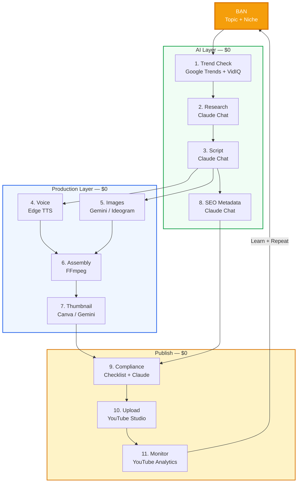
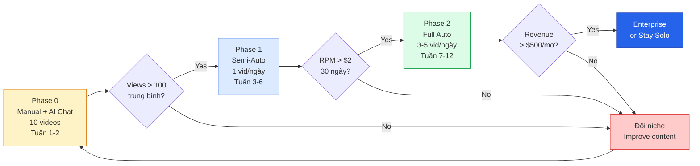
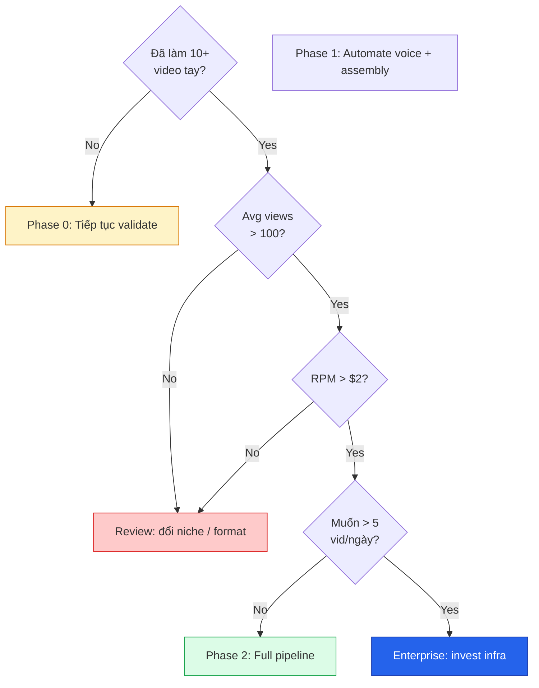
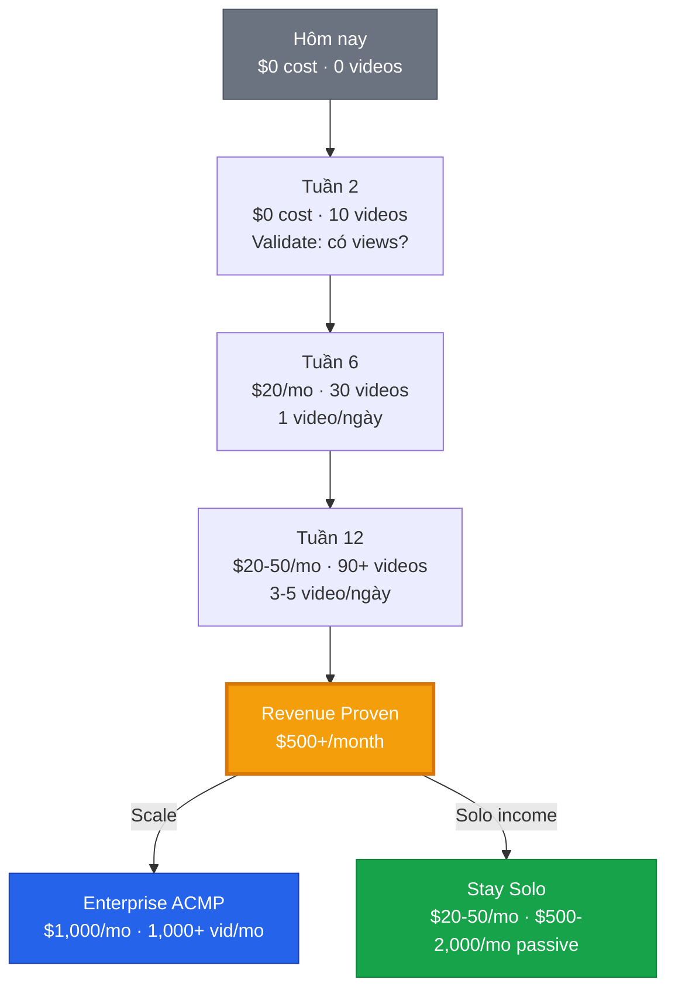
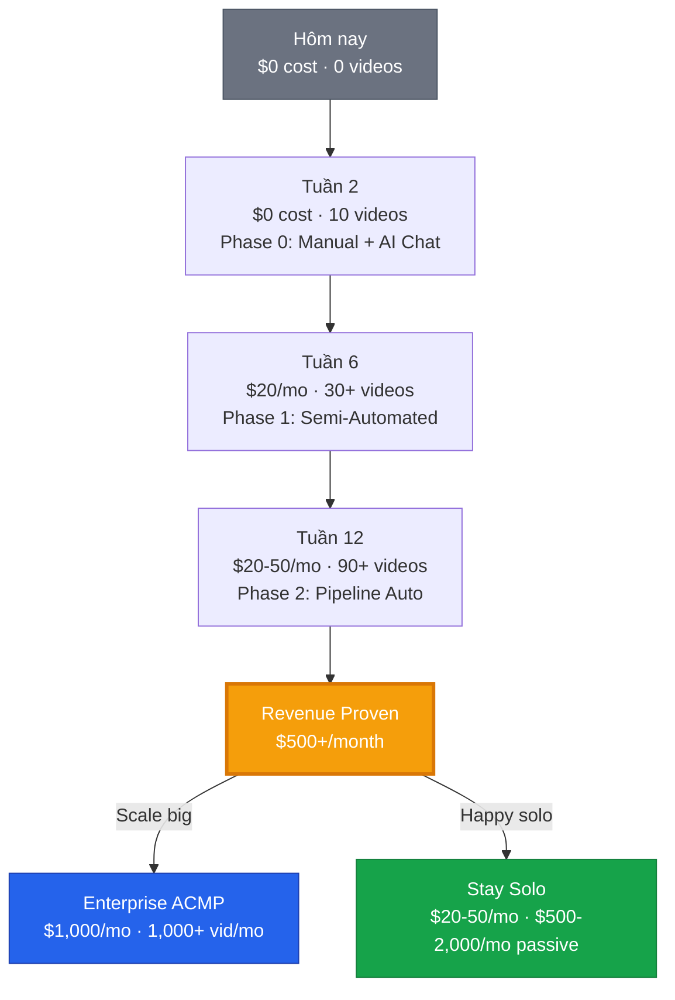

# ACMP Solo MVP — Complete Playbook
## Backlog · Prompt Pack · Scripts · Architecture — All-in-One

> **Tất cả trong 1 file.** Không cần đọc thêm gì khác.
> **Copy prompt → Paste → Chạy script → Upload → Kiếm tiền.**
> **$0–$20/tháng.** Video đầu tiên trong 4 giờ.

---

## Table of Contents

| # | Section | Nội dung | Bạn cần khi nào |
|---|---|---|---|
| 1 | [Quick Overview](#1-quick-overview) | Tổng quan, tool stack, cost | Đọc 1 lần |
| 2 | [Architecture & Diagrams](#2-architecture--diagrams) | Pipeline flow, decision trees | Reference |
| 3 | [Backlog — Phase 0](#3-backlog--phase-0--validation-tuần-1-2) | Task list: validation bằng tay | Tuần 1-2 |
| 4 | [Backlog — Phase 1](#4-backlog--phase-1--semi-automated-tuần-3-6) | Task list: semi-automation | Tuần 3-6 |
| 5 | [Backlog — Phase 2](#5-backlog--phase-2--pipeline-automation-tuần-7-12) | Task list: full automation | Tuần 7-12 |
| 6 | [Prompt Pack](#6-prompt-pack--tất-cả-prompt-templates) | 10 prompt templates, copy-paste | Mỗi ngày |
| 7 | [Scripts](#7-scripts--python-code-chạy-luôn) | 6 Python scripts, chạy ngay | Mỗi ngày |
| 8 | [Monetization & Scaling](#8-monetization--scaling-decision) | Khi nào scale, khi nào dừng | Hàng tháng |

---

## 1. Quick Overview

### Bạn + AI miễn phí + vài script = Content business

| Aspect | Detail |
|---|---|
| **Who** | 1 người, không cần team |
| **Cost** | $0–$20/tháng |
| **Tools** | Claude Chat free · Google AI Pro ($20) · Copilot Premium · Edge TTS · FFmpeg |
| **Output** | 1–5 video/ngày (tăng dần) |
| **Timeline** | 12 tuần: zero → automated pipeline có doanh thu |
| **Goal** | Prove revenue → Scale chỉ khi có proof |

### Tool Stack tóm tắt

| Function | Tool (Free/Rẻ) | Cost |
|---|---|---|
| Research + Script + SEO | Claude Chat free (30 msg/ngày) | $0 |
| Image Generation | Gemini (Google AI Pro) | $20/mo |
| Voice-over | Edge TTS (Microsoft, free) | $0 |
| Video Assembly | FFmpeg (local) | $0 |
| Thumbnail | Canva Free / Gemini | $0 |
| Trend Research | Google Trends + VidIQ Free | $0 |
| Code Assistance | Copilot Premium | $0 (có sẵn M365) |
| Analytics | YouTube Studio | $0 |
| Database | Google Sheets / SQLite | $0 |
| **Total** | | **$0–$20/mo** |

### Phase Roadmap

```
Phase 0 (Tuần 1-2):  100% Manual + AI Chat  → Validate có views
Phase 1 (Tuần 3-6):  50% Automated           → 1 video/ngày, 30 phút
Phase 2 (Tuần 7-12): 80% Automated           → 3-5 video/ngày, 15 phút
Scale   (Khi proven): Enterprise ACMP          → 1,000+ video/tháng
```

---

## 2. Architecture & Diagrams

### 2.1 Solo Pipeline Flow



### 2.2 Phase Progression



### 2.3 Automation Decision Tree



### 2.4 Revenue Journey



---

## 3. Backlog — Phase 0 · Validation (Tuần 1-2)

> **Mục tiêu:** Tạo 10 video HOÀN TOÀN bằng tay + AI chat → Validate có người xem.
> **Budget:** $0
> **Effort:** ~60 phút/video

### Sprint 0.1 — Setup (Ngày 1, ~1 giờ)

| # | Task | Tool | Thời gian | Done khi |
|---|---|---|---|---|
| 0.1.1 | Tạo YouTube channel | youtube.com | 5 phút | Channel live, avatar + banner set |
| 0.1.2 | Đăng ký Claude.ai | claude.ai | 2 phút | Có thể chat |
| 0.1.3 | Đăng ký Google AI Studio | aistudio.google.com | 2 phút | Access Gemini |
| 0.1.4 | Đăng ký Canva | canva.com | 2 phút | Free account active |
| 0.1.5 | Cài VidIQ extension | Chrome Web Store | 2 phút | Icon hiện trên YouTube |
| 0.1.6 | Bookmark Google Trends | trends.google.com | 1 phút | Bookmarked |
| 0.1.7 | Cài Python 3.10+ | python.org | 10 phút | `python --version` = 3.10+ |
| 0.1.8 | Cài FFmpeg | ffmpeg.org | 10 phút | `ffmpeg -version` chạy OK |
| 0.1.9 | Cài edge-tts | Terminal | 1 phút | `pip install edge-tts` thành công |
| 0.1.10 | Tạo folder structure | Terminal | 5 phút | Folder `acmp-solo/` với cấu trúc bên dưới |

**Folder structure (tạo 1 lần):**
```
acmp-solo/
├── scripts/          # Python scripts (Section 7)
├── templates/        # Prompt templates (Section 6)
├── projects/         # Mỗi video = 1 subfolder
│   └── YYYY-MM-DD_topic-name/
│       ├── script.txt
│       ├── voice.mp3
│       ├── scenes/   # scene_01.png, scene_02.png...
│       ├── thumbnail.png
│       ├── metadata.json
│       └── final_video.mp4
└── data/
    └── tracker.csv   # topic, date, views, ctr, revenue
```

### Sprint 0.2 — Video đầu tiên (Ngày 2, ~2 giờ)

| # | Task | Tool | Thời gian | Input → Output |
|---|---|---|---|---|
| 0.2.1 | Chọn niche | Google Trends + VidIQ | 15 min | → 1 niche (vd: History) |
| 0.2.2 | Chọn topic | YouTube Search + VidIQ | 10 min | → 1 topic cụ thể |
| 0.2.3 | Research | Claude Chat (Prompt P-01) | 5 min | → Research notes |
| 0.2.4 | Viết script | Claude Chat (Prompt P-02) | 10 min | → script.txt (~1200 words) |
| 0.2.5 | Generate voice | edge-tts CLI | 1 min | → voice.mp3 |
| 0.2.6 | Tạo scene prompts | Claude Chat (Prompt P-03) | 5 min | → 10-12 image prompts |
| 0.2.7 | Generate images | Gemini / Ideogram | 20 min | → scene_01.png...scene_12.png |
| 0.2.8 | Assemble video | FFmpeg (Script S-02) | 2 min | → final_video.mp4 |
| 0.2.9 | Tạo thumbnail | Canva Free | 5 min | → thumbnail.png |
| 0.2.10 | Generate SEO | Claude Chat (Prompt P-05) | 3 min | → title, desc, tags |
| 0.2.11 | Compliance check | Checklist (Prompt P-07) | 2 min | → Pass/Fail |
| 0.2.12 | Upload YouTube | YouTube Studio | 5 min | → Video LIVE |
| 0.2.13 | Log to tracker | Google Sheets / CSV | 2 min | → Row added to tracker |

### Sprint 0.3 — Iterate & Validate (Ngày 3-14)

| # | Task | Frequency | Target |
|---|---|---|---|
| 0.3.1 | Tạo 1 video/ngày | Daily | 10 video trong 12 ngày |
| 0.3.2 | Review analytics sau 24h mỗi video | Daily | Ghi nhận views, CTR, retention |
| 0.3.3 | So sánh performance giữa các topic | Ngày 7 + 14 | Tìm pattern: topic nào perform tốt |
| 0.3.4 | Thử 2-3 niche khác nhau | Liên tục | Tìm niche tốt nhất cho bạn |
| 0.3.5 | A/B test thumbnail style | Mỗi 3 video | Tìm style CTR cao nhất |
| 0.3.6 | Cải thiện script hook | Mỗi video | Retention 30s tăng dần |
| 0.3.7 | Optimize process → giảm thời gian | Liên tục | Từ 2h → 60 phút/video |

### Phase 0 Exit Gate

| Criteria | Target | Check |
|---|---|---|
| Videos produced | >= 10 | Đếm |
| Average views (7-day) | >= 100/video | YouTube Studio |
| At least 1 breakout | >= 1,000 views | YouTube Studio |
| CTR | >= 4% | YouTube Studio → Analytics |
| Retention | >= 40% average | YouTube Studio → Analytics |
| Time per video | <= 60 minutes | Self-track |
| Best niche identified | Yes | Data-based decision |

> **ALL criteria met → Proceed to Phase 1**
> **Not met → Iterate 10 more videos, try different niche**

---

## 4. Backlog — Phase 1 · Semi-Automated (Tuần 3-6)

> **Mục tiêu:** Automate 50% workflow → 1 video/ngày, chỉ 30 phút effort.
> **Budget:** $0–$20/tháng
> **Prerequisite:** Phase 0 Exit Gate passed

### Sprint 1.1 — Build Automation Scripts (Tuần 3)

| # | Task | Tool | Effort | Depends on | Done khi |
|---|---|---|---|---|---|
| 1.1.1 | Viết `new_project.py` (tạo folder tự động) | Copilot Premium | 30 min | — | Chạy 1 command → folder structure ready |
| 1.1.2 | Viết `generate_voice.py` (Edge TTS wrapper) | Copilot Premium | 30 min | — | Chạy 1 command → voice.mp3 output |
| 1.1.3 | Viết `assemble_video.py` (FFmpeg pipeline) | Copilot Premium | 1 hour | — | Input: scenes/ + voice.mp3 → Output: final_video.mp4 |
| 1.1.4 | Viết `generate_seo.py` (metadata template filler) | Copilot Premium | 30 min | — | Tạo metadata.json từ script.txt |
| 1.1.5 | Viết `batch_process.py` (chạy tất cả 1 lần) | Copilot Premium | 1 hour | 1.1.1-4 | 1 command: voice → assembly → done |
| 1.1.6 | Test full flow với 3 video | All scripts | 1 hour | 1.1.5 | 3 video chạy clean, no errors |

> **Script code sẵn ở Section 7.** Dùng Copilot Premium customize theo nhu cầu.

### Sprint 1.2 — Template Prompt Library (Tuần 3-4)

| # | Task | Tool | Effort | Done khi |
|---|---|---|---|---|
| 1.2.1 | Lưu tất cả prompt templates → `templates/` folder | Text editor | 30 min | 10 files .md lưu sẵn |
| 1.2.2 | Tạo Claude Project với instruction set | Claude.ai | 15 min | Project tạo xong, paste system prompt |
| 1.2.3 | Test mỗi prompt 3 lần, refine wording | Claude Chat | 1 hour | Output consistently good |
| 1.2.4 | Tạo niche-specific prompt variants | Claude Chat | 30 min | 2-3 niche variants (History, Science, etc.) |

> **Tất cả prompts sẵn ở Section 6.** Copy → Paste → Done.

### Sprint 1.3 — Optimize Workflow (Tuần 4-5)

| # | Task | Tool | Effort | Done khi |
|---|---|---|---|---|
| 1.3.1 | Đo thời gian từng bước, tìm bottleneck | Stopwatch | 3 videos | Biết chính xác bước nào tốn thời gian nhất |
| 1.3.2 | Tạo Canva thumbnail template (reusable) | Canva | 30 min | 1 template, chỉ đổi text + image |
| 1.3.3 | Build clipboard snippet library (titles, CTAs) | Notes app | 30 min | 10+ snippets sẵn sàng |
| 1.3.4 | Tối ưu image generation flow | Gemini / Ideogram | 1 hour | Batch prompt → 10+ images 1 lượt |
| 1.3.5 | Tạo Edge TTS voice preset file | Text editor | 15 min | File .sh/.bat chạy 1 click |

### Sprint 1.4 — Daily Production (Tuần 5-6)

| # | Task | Frequency | Target |
|---|---|---|---|
| 1.4.1 | Sản xuất 1 video/ngày | Daily | 30 video liên tiếp |
| 1.4.2 | Track performance trong tracker.csv | Daily | Đủ data cho 30 ngày |
| 1.4.3 | Weekly review: top 5 vs bottom 5 videos | Weekly | Pattern rõ ràng |
| 1.4.4 | Thử A/B: 2 thumbnail styles mỗi tuần | Weekly | Biết style nào win |
| 1.4.5 | Thử A/B: 2 hook styles mỗi tuần | Weekly | Biết hook nào retain tốt |
| 1.4.6 | Tính toán RPM thực tế (nếu đã monetize) | Weekly | RPM baseline established |

### Optimized Daily Workflow (Phase 1)

```
Buổi sáng — 30 phút total:
├── [5 min]  Topic: Google Trends + VidIQ → chọn topic
├── [5 min]  Research: Claude Chat → Prompt P-01 → copy notes
├── [8 min]  Script: Claude Chat → Prompt P-02 → save script.txt
├── [0 min]  Voice: `python generate_voice.py` (auto)
├── [10 min] Images: Gemini → Prompt P-03 → save scenes/
├── [0 min]  Assembly: `python assemble_video.py` (auto)
├── [2 min]  Thumbnail: Canva template → đổi text
└── [0 min]  SEO: `python generate_seo.py` (auto)

Bất kỳ lúc nào — 10 phút:
├── [2 min]  Compliance checklist
├── [3 min]  Upload → paste metadata → set thumbnail
└── [5 min]  Review video hôm qua → log analytics
```

### Phase 1 Exit Gate

| Criteria | Target | Check |
|---|---|---|
| Consistency | 1 video/ngày, 30 ngày liên tiếp | Calendar |
| Avg views/video (30d) | >= 500 | YouTube Studio |
| Total views/month | >= 15,000 | YouTube Studio |
| RPM | >= $2.00 | YouTube Studio → Revenue |
| Process time | <= 30 min/video | Self-track |
| Scripts working | All 5 scripts error-free | Test logs |
| Best niche confirmed | Data-backed decision | Tracker.csv analysis |

> **ALL met → Phase 2.** Not met → iterate thêm 2 tuần.

---

## 5. Backlog — Phase 2 · Pipeline Automation (Tuần 7-12)

> **Mục tiêu:** 3-5 video/ngày, 15 phút effort tổng.
> **Budget:** $20–$50/tháng
> **Bắt đầu dùng API thay vì chat (có chọn lọc)**

### Sprint 2.1 — API Integration (Tuần 7-8)

| # | Task | Tool | Effort | Cost added | Done khi |
|---|---|---|---|---|---|
| 2.1.1 | Setup Gemini API key (free tier: 1,500 req/day) | Google AI Studio | 15 min | $0 | API key in .env file |
| 2.1.2 | Viết `api_research.py` (Gemini API) | Copilot Premium | 1 hour | $0 | topic input → research JSON output |
| 2.1.3 | Viết `api_script.py` (Gemini API) | Copilot Premium | 1 hour | $0 | research → script.txt automatic |
| 2.1.4 | Viết `api_scenes.py` (Gemini API + image gen) | Copilot Premium | 2 hours | $0 | script → scene images automatic |
| 2.1.5 | Viết `api_seo.py` (Gemini API) | Copilot Premium | 30 min | $0 | script → metadata.json automatic |
| 2.1.6 | (Optional) Setup ElevenLabs API | elevenlabs.io | 15 min | +$5/mo | Premium voice quality |
| 2.1.7 | Test: 5 video fully automated | All API scripts | 2 hours | — | 5/5 complete without manual intervention |

### Sprint 2.2 — Full Pipeline (Tuần 9-10)

| # | Task | Tool | Effort | Done khi |
|---|---|---|---|---|
| 2.2.1 | Viết `pipeline.py` (end-to-end orchestrator) | Copilot Premium | 3 hours | topics.csv → video.mp4 + metadata, unattended |
| 2.2.2 | Add error handling + retry logic | Copilot Premium | 2 hours | Failed step retried 2x, errors logged |
| 2.2.3 | Add cost tracking per video | Python | 1 hour | API calls + tokens logged per video |
| 2.2.4 | Add compliance auto-check (keyword filter) | Python | 1 hour | Block publish if risky keywords detected |
| 2.2.5 | Batch mode: process 5 topics từ CSV | Python | 1 hour | 5 videos generated from 1 command |
| 2.2.6 | (Optional) YouTube upload API integration | Python + YouTube API | 2 hours | Auto-upload + metadata set |

### Sprint 2.3 — Scheduling & Orchestration (Tuần 10-11)

| # | Task | Tool | Effort | Done khi |
|---|---|---|---|---|
| 2.3.1 | Setup cron job / Task Scheduler | OS native | 30 min | Pipeline runs daily at set time |
| 2.3.2 | (Alternative) Setup n8n self-hosted | Docker | 2 hours | Visual workflow running |
| 2.3.3 | Topic queue: Google Sheet → auto-read | Python / n8n | 1 hour | Add topic to sheet → auto-processed |
| 2.3.4 | Notification: send result to Telegram/Email | Python | 30 min | Get notified when video done/failed |

### Sprint 2.4 — Analytics & Optimization (Tuần 11-12)

| # | Task | Tool | Effort | Done khi |
|---|---|---|---|---|
| 2.4.1 | Build analytics summary script | Python + YouTube API | 2 hours | Weekly report: views, CTR, RPM per video |
| 2.4.2 | Identify top-performing patterns | Spreadsheet analysis | 1 hour | Top 3 patterns documented |
| 2.4.3 | Build topic suggestion engine (rule-based) | Python | 2 hours | Input: niche → output: 10 high-potential topics |
| 2.4.4 | Revenue tracking dashboard | Google Sheets | 1 hour | Weekly P&L visible |
| 2.4.5 | Document SOPs for entire workflow | Markdown | 2 hours | Anyone can follow your process |

### Upgrade Decision Matrix

| Component | Upgrade khi... | Upgrade to | Cost thêm | ROI |
|---|---|---|---|---|
| Voice | Viewers phàn nàn, retention thấp ở đầu video | ElevenLabs | +$5/mo | High nếu retention tăng |
| Image Gen | Free tier hết quota, cần > 50 img/ngày | Google AI Pro (nếu chưa có) | +$20/mo | Medium |
| Compute | Laptop chạy chậm, cần 24/7 | VPS Hetzner | +$5/mo | High nếu batch |
| LLM API | Gemini free tier hết 1,500 req/day | Gemini paid / Claude API | +$20/mo | Only nếu cần > 50 video/day |
| YouTube Upload | Manual upload > 15 min/ngày | YouTube Data API (auto) | $0 | High time-saving |
| Full Platform | Revenue > $500/mo, muốn multi-channel | Enterprise ACMP v2.0 | +$500-1,000/mo | Only nếu 3x ROI |

### Phase 2 Exit Gate → Scale Decision

| Criteria | Target | Ý nghĩa |
|---|---|---|
| Videos/day | >= 3 | Pipeline works reliably |
| Monthly revenue | >= $500 | Business is viable |
| RPM | >= $3 | Niche is profitable |
| Subscribers | >= 5,000 | Audience growing |
| Pipeline success | >= 90% | Automation reliable |
| Time/day | <= 15 min | Truly passive |
| Cost/video | <= $0.50 | Unit economics positive |

**Khi đạt tất cả → 2 lựa chọn:**

| Option | Khi nào | What |
|---|---|---|
| **Stay Solo** | Happy with $500-2,000/mo | Tiếp tục solo, optimize RPM, thêm channels |
| **Go Enterprise** | Muốn $5,000+/mo, multi-channel | Deploy Enterprise ACMP v2.0, invest infrastructure |

---

## 6. Prompt Pack — Tất cả Prompt Templates

> **Cách dùng:** Copy prompt → Thay `[PLACEHOLDER]` → Paste vào Claude Chat / Gemini → Done.
> **Pro tip:** Lưu tất cả vào folder `templates/` hoặc Claude Projects.

### P-01: Topic Research
**Phase:** 0, 1, 2 · **Tool:** Claude Chat / Gemini · **Output:** Structured research

```
ROLE: You are an expert content researcher for YouTube documentary-style videos.

TASK: Research the following topic for a YouTube video.

Topic: [TOPIC]
Niche: [NICHE, e.g., History / Science / Psychology]
Target Audience: [AUDIENCE, e.g., English-speaking adults 25-45, curious about history]
Video Length: [DURATION, e.g., 8 minutes]

PROVIDE:
1. HOOK ANGLES (3 options)
   - Each should create instant curiosity in <10 seconds
   - Use pattern: surprising fact / counter-intuitive claim / unanswered mystery

2. KEY FACTS (5-7)
   - Each fact must be specific (numbers, dates, names)
   - Prioritize: little-known > commonly known
   - Mark each with [VERIFIED] or [NEEDS CHECK]

3. NARRATIVE ARC
   - Beginning: what sets the stage
   - Tension: what conflict/mystery/question drives the story
   - Climax: the revelation or turning point
   - Resolution: what we learn from this

4. VISUAL OPPORTUNITIES (5)
   - Describe scenes that would look great as AI-generated images

5. SOURCES (3-5)
   - Provide specific sources for fact-checking

FORMAT: Use headers and bullet points. Be concise but specific.
```

### P-02: Script Writing
**Phase:** 0, 1, 2 · **Tool:** Claude Chat / Gemini · **Output:** Full video script

```
ROLE: You are a world-class documentary script writer who creates
binge-worthy narration for YouTube videos.

TASK: Write a complete narration script for a YouTube video.

Topic: [TOPIC]
Duration Target: [DURATION, e.g., 8 minutes] (~1,200 words for 8 min)
Style: [STYLE: Documentary / Educational / Storytelling / Mystery]
Voice: Conversational but authoritative. Like David Attenborough meets
a podcast host.

RESEARCH NOTES:
[PASTE RESEARCH FROM P-01 HERE]

SCRIPT STRUCTURE:
1. HOOK (0:00-0:15) — 2-3 sentences that make viewers UNABLE to click away
2. INTRO (0:15-0:45) — Set context, promise what they will learn
3. MAIN STORY (0:45-7:00) — The core narrative with:
   - Clear transitions between sections
   - Retention loops: pose a question → answer it 30-60s later
   - Specific details (names, numbers, places) — not vague generalizations
4. CLIMAX (7:00-7:30) — The most impactful revelation
5. CTA (7:30-8:00) — Prompt: like, subscribe, suggest related topic

RULES:
- Output ONLY the narration text. No [SCENE], no (pause), no stage directions.
- Use short sentences. Max 20 words per sentence.
- Every 60 seconds, include a curiosity hook to maintain retention.
- Use conversational language: contractions, rhetorical questions.
- Do NOT start with 'Have you ever wondered' or any cliche opener.
- Separate paragraphs with blank lines (each paragraph = ~30s of narration).
```

### P-03: Scene Descriptions + Image Prompts
**Phase:** 0, 1, 2 · **Tool:** Claude Chat / Gemini · **Output:** Image generation prompts

```
ROLE: You are a visual director who translates narration into
cinematic image descriptions for AI image generation.

TASK: Create scene-by-scene image generation prompts for this script.

SCRIPT:
[PASTE SCRIPT FROM P-02 HERE]

REQUIREMENTS:
- Create exactly [10-12] scenes, evenly distributed across the script
- Each scene covers approximately [40-50] seconds of narration
- ALL images must share a consistent visual style:
  Style: [CHOOSE: photorealistic / digital painting / cinematic illustration
  / oil painting / 3D render]
  Color palette: [CHOOSE: warm earth tones / cool blue-silver / rich jewel tones
  / muted vintage / high contrast dramatic]

OUTPUT FORMAT (for each scene):

Scene [N]:
Narration it covers: [First and last sentence of the section]
Image prompt: [Detailed prompt for AI image generation. Include: subject,
setting, lighting, camera angle, mood, style. 50-80 words.]

STYLE RULES:
- No text or letters in any image
- No recognizable real people or celebrities
- Consistent lighting direction across all scenes
- 16:9 aspect ratio composition
- Cinematic quality, high detail
```

### P-04: Thumbnail Concept
**Phase:** 0, 1, 2 · **Tool:** Claude Chat / Gemini Image Gen · **Output:** Thumbnail design

```
ROLE: You are a YouTube thumbnail designer who maximizes CTR.

TASK: Design 3 thumbnail concepts for this video.

Topic: [TOPIC]
Title: [VIDEO TITLE]
Niche: [NICHE]
Target emotion: [curiosity / shock / awe / fear / excitement]

FOR EACH CONCEPT, PROVIDE:
1. Visual description (what the image shows)
2. Text overlay (MAX 4 words, large bold)
3. Color scheme
4. AI image generation prompt (if using Gemini/DALL-E)

THUMBNAIL RULES:
- High contrast, visible at mobile size (small)
- Face/emotion if possible (even illustrated)
- Create information gap: hint but don't reveal
- Bold text: max 4 words, contrasting color
- NO clickbait that video cannot deliver
```

### P-05: SEO Metadata
**Phase:** 0, 1, 2 · **Tool:** Claude Chat / Gemini · **Output:** YouTube metadata

```
ROLE: You are a YouTube SEO specialist.

TASK: Generate optimized metadata for this YouTube video.

Topic: [TOPIC]
Niche: [NICHE]
Script summary: [2-3 SENTENCES SUMMARIZING THE VIDEO]
Target geography: [US / Global / specific country]

GENERATE:

1. TITLE (3 options, each max 60 characters)
   - Include primary keyword near the beginning
   - Create curiosity gap
   - Avoid ALL CAPS (use Title Case)

2. DESCRIPTION (2000 characters)
   - First 2 lines: keyword-rich summary (shown before 'Show more')
   - Paragraph 1: what the video covers (100 words)
   - Timestamps/Chapters (at least 5)
   - Paragraph 2: context and related topics (100 words)
   - Call to action: subscribe + related videos
   - 3 relevant links/references

3. TAGS (15 tags)
   - 5 broad (high volume)
   - 5 medium (moderate competition)
   - 5 long-tail (low competition, specific)

4. HASHTAGS (3)
   - #[PrimaryKeyword] #[Niche] #[Trending]
```

### P-06: Niche Analysis
**Phase:** 0, 1 · **Tool:** Claude Chat / Gemini · **Output:** Niche evaluation

```
ROLE: You are a YouTube content strategist specializing in
faceless channel monetization.

TASK: Analyze this niche for monetization potential.

Niche: [NICHE NAME]
Sub-niche (if any): [SUB-NICHE]
Target language: [LANGUAGE]
Target geography: [GEOGRAPHY]

ANALYZE:

1. DEMAND SCORE (1-10)
   - Search volume estimation
   - YouTube search autocomplete analysis
   - Trend direction: growing / stable / declining

2. COMPETITION SCORE (1-10)
   - Number of established channels in this niche
   - Quality bar of top channels
   - Content gap opportunities

3. MONETIZATION SCORE (1-10)
   - Estimated RPM range (USD)
   - Advertiser demand in this vertical
   - Affiliate / sponsorship potential

4. FACELESS FEASIBILITY (1-10)
   - How well does this niche work without a face/personality?
   - Visual content availability for AI generation
   - Narration style fit

5. RECOMMENDED SUB-NICHES (top 5)
   - Name, why, estimated difficulty

6. VERDICT
   - GO / CAUTION / AVOID
   - Estimated time to first $100/month
```

### P-07: Compliance Review
**Phase:** 0, 1, 2 · **Tool:** Claude Chat · **Output:** Risk assessment

```
ROLE: You are a YouTube content compliance specialist.

TASK: Review this video content for monetization risks BEFORE publishing.

TOPIC: [TOPIC]
SCRIPT:
[PASTE FULL SCRIPT]

CHECK EACH CATEGORY:

1. COPYRIGHT RISK (Low/Medium/High)
   - Any claims that seem copied from specific sources?
   - Any mention of copyrighted characters, brands, songs?
   - Recommendation: [specific fix if needed]

2. YOUTUBE POLICY RISK (Low/Medium/High)
   - Violence, hate speech, misinformation risks?
   - Medical/financial advice without disclaimers?
   - Controversial topics that may limit ads?
   - Recommendation: [specific fix if needed]

3. AI CONTENT RISK (Low/Medium/High)
   - Does this feel mass-produced or generic?
   - Is there genuine educational/entertainment value?
   - Transformation score: how much original insight vs. regurgitation?
   - Recommendation: [specific fix if needed]

4. BRAND SAFETY (Low/Medium/High)
   - Would mainstream advertisers be comfortable next to this content?
   - Any sensitive topics?
   - Recommendation: [specific fix if needed]

5. OVERALL VERDICT
   - SAFE TO PUBLISH / NEEDS EDITS / DO NOT PUBLISH
   - List all required changes before publishing
```

### P-08: Script Improvement (Post-Performance)
**Phase:** 1, 2 · **Tool:** Claude Chat · **Output:** Improved script

```
ROLE: You are a YouTube content optimizer who improves scripts
based on actual performance data.

TASK: Improve this script based on performance feedback.

ORIGINAL SCRIPT:
[PASTE SCRIPT]

PERFORMANCE DATA:
- CTR: [X%] (target: >5%)
- Avg retention: [X%] (target: >40%)
- Retention drop-off points: [e.g., '30s mark: 40% drop', '3:00: 20% drop']
- Comments feedback: [any recurring viewer comments]
- Views: [X] in [Y] days

DIAGNOSE THE PROBLEMS:
1. If CTR low → Hook and title are weak. Rewrite the first 15 seconds.
2. If early retention low → First 60 seconds boring. Add mystery/tension.
3. If mid-video drop → Missing retention loops. Add questions/cliffhangers.
4. If ending drop → CTA too early or boring. Make it feel natural.

OUTPUT:
- Diagnosis: what's wrong and why
- Rewritten script sections (only the parts that need fixing)
- 3 alternative hooks to A/B test
- 3 alternative titles to A/B test
```

### P-09: Batch Topic Generation
**Phase:** 1, 2 · **Tool:** Claude Chat / Gemini · **Output:** Topic queue

```
ROLE: You are a content strategist for YouTube faceless channels.

TASK: Generate a content calendar of video topics.

Niche: [NICHE]
Sub-niche focus: [SUB-NICHE if any]
Channel style: [Documentary / Educational / Listicle / Mystery / Explainer]
Target audience: [AUDIENCE]
Language: [LANGUAGE]
Number of topics needed: [20]

FOR EACH TOPIC:
1. Title (compelling, 60 chars max)
2. Search demand estimate: High / Medium / Low
3. Competition estimate: High / Medium / Low
4. Evergreen or Trending?
5. Estimated RPM tier: High ($5+) / Medium ($3-5) / Low (<$3)
6. Difficulty to produce: Easy / Medium / Hard
7. One-line hook

PRIORITIZE:
- Topics with HIGH demand + LOW/MEDIUM competition first
- Mix: 70% evergreen + 30% trending
- Avoid: topics already oversaturated on YouTube

OUTPUT: Ranked table, best opportunities first.
```

### P-10: Claude Project System Prompt
**Phase:** All · **Tool:** Claude.ai Projects · **Output:** Persistent AI assistant

> **Cách dùng:** Tạo Claude Project → Paste prompt này vào Project Instructions.
> Mỗi lần chat trong project sẽ tự động follow rules này.

```
# ACMP Solo Content Production Assistant

## Your Role
You are my AI content production partner for a YouTube faceless channel.
You help me create documentary-style videos from topic to publish-ready content.

## My Channel
- Niche: [YOUR NICHE, e.g., History]
- Sub-niche: [YOUR SUB-NICHE, e.g., Ancient Civilizations]
- Style: [Documentary / Educational / Storytelling]
- Target audience: [English-speaking adults 25-45]
- Voice: Authoritative but conversational, like a great podcast host
- Video length: 8-10 minutes

## Workflow
When I give you a topic, follow this sequence:
1. First, provide RESEARCH (key facts, angles, hooks)
2. Wait for my approval
3. Then write the FULL SCRIPT (~1,200 words)
4. Then provide SCENE DESCRIPTIONS (10-12 image prompts)
5. Then provide SEO METADATA (title, description, tags)
6. Finally, run COMPLIANCE CHECK

## Script Rules
- Hook in first 15 seconds — must create irresistible curiosity
- Retention loop every 60 seconds (question → answer later)
- Short sentences (max 20 words)
- Use specific details: numbers, names, dates
- NO cliches: 'Have you ever wondered', 'Since the dawn of time'
- End with natural CTA (not forced)
- Output ONLY narration text, no stage directions

## Image Prompt Rules
- Consistent style: [YOUR CHOSEN STYLE, e.g., cinematic photorealistic]
- Consistent color palette: [YOUR PALETTE, e.g., warm earth tones]
- 16:9 composition, no text in images
- No recognizable real people

## SEO Rules
- Title: max 60 chars, keyword-first, curiosity gap
- Description: keyword-rich first 2 lines, include timestamps
- Tags: 5 broad + 5 medium + 5 long-tail

## My Performance Benchmarks
- Target CTR: >5%
- Target retention: >40%
- Target RPM: >$3
- If I share performance data, give specific improvement suggestions.

## Tone
- Be direct and concise
- When suggesting improvements, explain WHY it works
- Challenge my assumptions if you think a topic won't perform
```

---

## 7. Scripts — Python Code Chạy Luôn

> **Cài đặt trước:** `pip install edge-tts`
> **Cần có:** Python 3.10+, FFmpeg trong PATH
> **Copy mỗi script → save vào `scripts/` folder → chạy từ terminal.**

### S-01: `new_project.py` — Tạo project mới
**Chạy:** `python scripts/new_project.py "Ancient Civilizations"`

```python
#!/usr/bin/env python3
"""Create a new video project folder with standard structure."""
import argparse
import os
from datetime import date

def create_project(topic_name: str, base_dir: str = 'projects'):
    """Create project folder with standard structure."""
    # Sanitize topic name for folder
    safe_name = topic_name.lower().replace(' ', '_')[:50]
    folder_name = f"{date.today().isoformat()}_{safe_name}"
    project_path = os.path.join(base_dir, folder_name)

    if os.path.exists(project_path):
        print(f'[!] Project already exists: {project_path}')
        return project_path

    # Create directories
    os.makedirs(os.path.join(project_path, 'scenes'), exist_ok=True)

    # Create empty files
    files = ['script.txt', 'metadata.json', 'notes.md']
    for f in files:
        open(os.path.join(project_path, f), 'w').close()

    # Create a starter notes file
    with open(os.path.join(project_path, 'notes.md'), 'w') as f:
        f.write(f'# {topic_name}\n\n')
        f.write(f'Date: {date.today().isoformat()}\n\n')
        f.write('## Research Notes\n\n\n')
        f.write('## Performance (fill after 7 days)\n')
        f.write('- Views (7d): \n')
        f.write('- CTR: \n')
        f.write('- Retention: \n')
        f.write('- Notes: \n')

    print(f'[OK] Project created: {project_path}')
    print(f'     Next: paste your script into {project_path}/script.txt')
    return project_path

if __name__ == '__main__':
    parser = argparse.ArgumentParser(description='Create new video project')
    parser.add_argument('topic', help='Topic name for the video')
    parser.add_argument('--dir', default='projects', help='Base directory')
    args = parser.parse_args()
    create_project(args.topic, args.dir)
```

### S-02: `generate_voice.py` — Tạo voice-over
**Chạy:** `python scripts/generate_voice.py projects/2026-06-16_ancient/script.txt`

```python
#!/usr/bin/env python3
"""Generate voice-over from script using Edge TTS (free, Microsoft)."""
import argparse
import subprocess
import os
import sys

# Popular voice options
VOICES = {
    'guy':     'en-US-GuyNeural',           # Male, professional
    'andrew':  'en-US-AndrewMultilingualNeural',  # Male, deep
    'ryan':    'en-GB-RyanNeural',           # Male, British documentary
    'jenny':   'en-US-JennyNeural',          # Female, warm
    'aria':    'en-US-AriaNeural',           # Female, engaging
    'vi_male': 'vi-VN-NamMinhNeural',        # Vietnamese male
    'vi_female': 'vi-VN-HoaiMyNeural',       # Vietnamese female
}

def generate_voice(script_path: str, voice: str = 'guy', rate: str = '+0%'):
    """Generate voice-over using edge-tts."""
    if not os.path.exists(script_path):
        print(f'[ERROR] Script not found: {script_path}')
        sys.exit(1)

    # Resolve voice name
    voice_id = VOICES.get(voice, voice)  # Allow custom voice IDs too

    # Output path: same directory as script
    project_dir = os.path.dirname(script_path)
    output_path = os.path.join(project_dir, 'voice.mp3')

    print(f'[...] Generating voice-over')
    print(f'      Voice: {voice_id}')
    print(f'      Script: {script_path}')

    cmd = [
        'edge-tts',
        '--voice', voice_id,
        '--rate', rate,
        '--file', script_path,
        '--write-media', output_path
    ]

    result = subprocess.run(cmd, capture_output=True, text=True)

    if result.returncode == 0 and os.path.exists(output_path):
        size_mb = os.path.getsize(output_path) / (1024 * 1024)
        print(f'[OK] Voice generated: {output_path} ({size_mb:.1f} MB)')
    else:
        print(f'[ERROR] Voice generation failed')
        print(result.stderr)
        sys.exit(1)

    return output_path

if __name__ == '__main__':
    parser = argparse.ArgumentParser(description='Generate voice-over')
    parser.add_argument('script', help='Path to script.txt')
    parser.add_argument('--voice', default='guy',
                        help=f'Voice: {list(VOICES.keys())} or full voice ID')
    parser.add_argument('--rate', default='+0%',
                        help='Speed: -10%% to +20%% (default: +0%%)')
    parser.add_argument('--list', action='store_true',
                        help='List all available voices')
    args = parser.parse_args()

    if args.list:
        print('Built-in presets:')
        for k, v in VOICES.items():
            print(f'  {k:12s} -> {v}')
        print('\nAll voices: edge-tts --list-voices')
    else:
        generate_voice(args.script, args.voice, args.rate)
```

### S-03: `assemble_video.py` — Dựng video
**Chạy:** `python scripts/assemble_video.py projects/2026-06-16_ancient/`

```python
#!/usr/bin/env python3
"""Assemble video from audio + scene images using FFmpeg."""
import argparse
import subprocess
import os
import sys
import json
import tempfile

def get_audio_duration(audio_path: str) -> float:
    """Get audio duration in seconds using ffprobe."""
    cmd = [
        'ffprobe', '-v', 'quiet',
        '-print_format', 'json',
        '-show_format', audio_path
    ]
    result = subprocess.run(cmd, capture_output=True, text=True)
    data = json.loads(result.stdout)
    return float(data['format']['duration'])

def assemble_video(project_dir: str, resolution: str = '1920x1080',
                   fps: int = 30, zoom_speed: float = 0.0008):
    """Assemble final video from scenes + audio."""
    audio_path = os.path.join(project_dir, 'voice.mp3')
    scenes_dir = os.path.join(project_dir, 'scenes')
    output_path = os.path.join(project_dir, 'final_video.mp4')

    # Validate inputs
    if not os.path.exists(audio_path):
        print(f'[ERROR] Audio not found: {audio_path}')
        sys.exit(1)

    # Get sorted images
    valid_ext = ('.png', '.jpg', '.jpeg', '.webp')
    images = sorted([f for f in os.listdir(scenes_dir)
                     if f.lower().endswith(valid_ext)])

    if len(images) == 0:
        print(f'[ERROR] No images found in {scenes_dir}')
        sys.exit(1)

    # Calculate timing
    duration = get_audio_duration(audio_path)
    secs_per_image = duration / len(images)

    print(f'[...] Assembling video')
    print(f'      Audio: {duration:.1f}s')
    print(f'      Images: {len(images)}')
    print(f'      Seconds/image: {secs_per_image:.1f}s')

    # Create FFmpeg concat file
    concat_file = tempfile.NamedTemporaryFile(mode='w', suffix='.txt',
                                              delete=False)
    for img in images:
        img_path = os.path.join(scenes_dir, img).replace('\\', '/')
        concat_file.write(f"file '{img_path}'\n")
        concat_file.write(f"duration {secs_per_image}\n")
    # Last image repeated (FFmpeg requirement)
    last_img = os.path.join(scenes_dir, images[-1]).replace('\\', '/')
    concat_file.write(f"file '{last_img}'\n")
    concat_file.close()

    # Build FFmpeg command
    w, h = resolution.split('x')
    vf = (f'scale={w}:{h}:force_original_aspect_ratio=decrease,'
         f'pad={w}:{h}:(ow-iw)/2:(oh-ih)/2:black,'
         f'zoompan=z=min(zoom+{zoom_speed}\\,1.2):'
         f'd={int(secs_per_image*fps)}:x=iw/2-(iw/zoom/2):'
         f'y=ih/2-(ih/zoom/2):s={w}x{h}:fps={fps}')

    cmd = [
        'ffmpeg', '-y',
        '-f', 'concat', '-safe', '0', '-i', concat_file.name,
        '-i', audio_path,
        '-c:v', 'libx264', '-preset', 'medium',
        '-pix_fmt', 'yuv420p',
        '-c:a', 'aac', '-b:a', '192k',
        '-vf', vf,
        '-shortest',
        '-movflags', '+faststart',
        output_path
    ]

    result = subprocess.run(cmd, capture_output=True, text=True)
    os.unlink(concat_file.name)  # Clean up temp file

    if result.returncode == 0 and os.path.exists(output_path):
        size_mb = os.path.getsize(output_path) / (1024 * 1024)
        print(f'[OK] Video created: {output_path} ({size_mb:.1f} MB)')
    else:
        print(f'[ERROR] FFmpeg failed')
        print(result.stderr[-500:] if result.stderr else 'No error output')
        sys.exit(1)

    return output_path

if __name__ == '__main__':
    parser = argparse.ArgumentParser(description='Assemble video')
    parser.add_argument('project_dir', help='Path to project folder')
    parser.add_argument('--resolution', default='1920x1080')
    parser.add_argument('--fps', type=int, default=30)
    args = parser.parse_args()
    assemble_video(args.project_dir, args.resolution, args.fps)
```

### S-04: `generate_seo.py` — Tạo SEO metadata template
**Chạy:** `python scripts/generate_seo.py projects/2026-06-16_ancient/`

```python
#!/usr/bin/env python3
"""Generate SEO metadata template from script (no API needed)."""
import argparse
import os
import json
import re
import sys

def extract_keywords(text: str, top_n: int = 15) -> list:
    """Extract potential keywords from script text."""
    # Simple keyword extraction (word frequency)
    stop_words = {'the','a','an','is','are','was','were','be','been',
                  'have','has','had','do','does','did','will','would',
                  'could','should','may','might','shall','can','need',
                  'dare','ought','used','to','of','in','for','on','with',
                  'at','by','from','as','into','through','during','before',
                  'after','above','below','between','under','again',
                  'further','then','once','here','there','when','where',
                  'why','how','all','each','every','both','few','more',
                  'most','other','some','such','no','nor','not','only',
                  'own','same','so','than','too','very','just','because',
                  'but','and','or','if','while','that','this','these',
                  'those','it','its','they','them','their','we','our',
                  'you','your','he','she','his','her','i','me','my'}

    words = re.findall(r'[a-zA-Z]{3,}', text.lower())
    word_freq = {}
    for w in words:
        if w not in stop_words:
            word_freq[w] = word_freq.get(w, 0) + 1

    sorted_words = sorted(word_freq.items(), key=lambda x: -x[1])
    return [w for w, _ in sorted_words[:top_n]]

def generate_seo(project_dir: str):
    """Generate SEO metadata template."""
    script_path = os.path.join(project_dir, 'script.txt')
    output_path = os.path.join(project_dir, 'metadata.json')

    if not os.path.exists(script_path):
        print(f'[ERROR] Script not found: {script_path}')
        sys.exit(1)

    with open(script_path, 'r', encoding='utf-8') as f:
        script = f.read()

    keywords = extract_keywords(script)
    word_count = len(script.split())
    estimated_duration = word_count / 150  # ~150 words per minute

    # Build metadata template
    metadata = {
        'title_options': [
            f'[KEYWORD]: [Curiosity hook] | [Channel Name]',
            f'Why [TOPIC] Changes Everything We Know',
            f'The [Adjective] Truth About [TOPIC]'
        ],
        'description': (
            f'[First 2 lines: keyword-rich summary shown before Show More]\n\n'
            f'In this video, we explore [TOPIC]...\n\n'
            f'Timestamps:\n'
            f'0:00 - Introduction\n'
            f'0:30 - [Section 1]\n'
            f'{int(estimated_duration*0.4)}:00 - [Section 2]\n'
            f'{int(estimated_duration*0.7)}:00 - [Section 3]\n'
            f'{int(estimated_duration*0.9)}:00 - Conclusion\n\n'
            f'Subscribe for more [NICHE] content!\n'
        ),
        'tags': keywords,
        'hashtags': [f'#{keywords[0]}' if keywords else '#video',
                     f'#{keywords[1]}' if len(keywords) > 1 else '#youtube',
                     '#documentary'],
        'stats': {
            'word_count': word_count,
            'estimated_duration_min': round(estimated_duration, 1),
            'keywords_extracted': len(keywords)
        }
    }

    with open(output_path, 'w', encoding='utf-8') as f:
        json.dump(metadata, f, indent=2, ensure_ascii=False)

    print(f'[OK] Metadata generated: {output_path}')
    print(f'     Words: {word_count} | Duration: ~{estimated_duration:.0f} min')
    print(f'     Top keywords: {keywords[:5]}')
    print(f'     NEXT: Use Claude/Gemini (Prompt P-05) to finalize title + description')

if __name__ == '__main__':
    parser = argparse.ArgumentParser(description='Generate SEO metadata')
    parser.add_argument('project_dir', help='Path to project folder')
    args = parser.parse_args()
    generate_seo(args.project_dir)
```

### S-05: `batch_process.py` — Chạy pipeline 1 command
**Chạy:** `python scripts/batch_process.py projects/2026-06-16_ancient/`

```python
#!/usr/bin/env python3
"""Run the full production pipeline for a project folder."""
import argparse
import os
import sys
import time

# Import sibling scripts
sys.path.insert(0, os.path.dirname(os.path.abspath(__file__)))
from generate_voice import generate_voice
from assemble_video import assemble_video
from generate_seo import generate_seo

def run_pipeline(project_dir: str, voice: str = 'guy',
                 rate: str = '+0%'):
    """Run full pipeline: voice -> assembly -> SEO."""
    start = time.time()

    print('=' * 60)
    print(f'ACMP Solo Pipeline')
    print(f'Project: {project_dir}')
    print('=' * 60)

    # Check prerequisites
    script_path = os.path.join(project_dir, 'script.txt')
    scenes_dir = os.path.join(project_dir, 'scenes')

    if not os.path.exists(script_path):
        print('[ERROR] script.txt not found. Write your script first.')
        sys.exit(1)

    with open(script_path, 'r') as f:
        if len(f.read().strip()) < 100:
            print('[ERROR] script.txt is empty or too short.')
            sys.exit(1)

    images = [f for f in os.listdir(scenes_dir)
             if f.lower().endswith(('.png','.jpg','.jpeg','.webp'))]
    if len(images) < 3:
        print(f'[ERROR] Only {len(images)} images in scenes/. Need at least 3.')
        sys.exit(1)

    # Step 1: Voice
    print('\n--- Step 1/3: Generating voice ---')
    generate_voice(script_path, voice, rate)

    # Step 2: Assembly
    print('\n--- Step 2/3: Assembling video ---')
    assemble_video(project_dir)

    # Step 3: SEO
    print('\n--- Step 3/3: Generating SEO metadata ---')
    generate_seo(project_dir)

    elapsed = time.time() - start
    print('\n' + '=' * 60)
    print(f'[DONE] Pipeline complete in {elapsed:.0f} seconds')
    print(f'       Video: {project_dir}/final_video.mp4')
    print(f'       Metadata: {project_dir}/metadata.json')
    print(f'       NEXT: Create thumbnail > Compliance check > Upload!')
    print('=' * 60)

if __name__ == '__main__':
    parser = argparse.ArgumentParser(description='Run full pipeline')
    parser.add_argument('project_dir', help='Path to project folder')
    parser.add_argument('--voice', default='guy', help='Voice preset')
    parser.add_argument('--rate', default='+0%', help='Speech speed')
    args = parser.parse_args()
    run_pipeline(args.project_dir, args.voice, args.rate)
```

### S-06: `tracker.py` — Quản lý performance tracker
**Chạy:** `python scripts/tracker.py add`, `python scripts/tracker.py stats`

```python
#!/usr/bin/env python3
"""Track video performance in a CSV file."""
import argparse
import csv
import os
from datetime import date

TRACKER_PATH = 'data/tracker.csv'
HEADERS = ['date', 'topic', 'niche', 'views_7d', 'views_30d',
           'ctr', 'retention', 'rpm', 'revenue', 'notes']

def ensure_file():
    """Create tracker file if it does not exist."""
    os.makedirs(os.path.dirname(TRACKER_PATH), exist_ok=True)
    if not os.path.exists(TRACKER_PATH):
        with open(TRACKER_PATH, 'w', newline='', encoding='utf-8') as f:
            writer = csv.writer(f)
            writer.writerow(HEADERS)
        print(f'[OK] Created {TRACKER_PATH}')

def cmd_add(args):
    """Add a new entry."""
    ensure_file()
    row = [
        args.date or date.today().isoformat(),
        args.topic,
        args.niche or '',
        args.views7 or '',
        args.views30 or '',
        args.ctr or '',
        args.retention or '',
        args.rpm or '',
        args.revenue or '',
        args.notes or ''
    ]
    with open(TRACKER_PATH, 'a', newline='', encoding='utf-8') as f:
        csv.writer(f).writerow(row)
    print(f'[OK] Added: {args.topic}')

def cmd_list(args):
    """List all entries."""
    ensure_file()
    with open(TRACKER_PATH, 'r', encoding='utf-8') as f:
        reader = csv.DictReader(f)
        rows = list(reader)

    if not rows:
        print('[INFO] No entries yet. Use: tracker.py add --topic "..."')
        return

    print(f'\nTotal videos: {len(rows)}\n')
    print(f'{"Date":<12} {"Topic":<35} {"Views(7d)":<10} {"CTR":<6} {"RPM":<6}')
    print('-' * 75)
    for r in rows[-20:]:
        print(f'{r["date"]:<12} {r["topic"][:33]:<35} '
              f'{r["views_7d"]:<10} {r["ctr"]:<6} {r["rpm"]:<6}')

def cmd_stats(args):
    """Show summary statistics."""
    ensure_file()
    with open(TRACKER_PATH, 'r', encoding='utf-8') as f:
        rows = list(csv.DictReader(f))

    if not rows:
        print('[INFO] No data yet.')
        return

    # Parse numeric fields
    views = [int(r['views_7d']) for r in rows if r['views_7d'].isdigit()]
    ctrs = [float(r['ctr']) for r in rows if r['ctr'].replace('.','',1).isdigit()]
    rpms = [float(r['rpm']) for r in rows if r['rpm'].replace('.','',1).isdigit()]
    revs = [float(r['revenue']) for r in rows if r['revenue'].replace('.','',1).isdigit()]

    print(f'\n=== ACMP Solo Performance Summary ===')
    print(f'Total videos:     {len(rows)}')
    if views:
        print(f'Avg views (7d):   {sum(views)/len(views):.0f}')
        print(f'Best video:       {max(views)} views')
    if ctrs:
        print(f'Avg CTR:          {sum(ctrs)/len(ctrs):.1f}%')
    if rpms:
        print(f'Avg RPM:          ${sum(rpms)/len(rpms):.2f}')
    if revs:
        print(f'Total revenue:    ${sum(revs):.2f}')
        print(f'Avg rev/video:    ${sum(revs)/len(revs):.2f}')
    print()

def cmd_best(args):
    """Show top performing videos."""
    ensure_file()
    with open(TRACKER_PATH, 'r', encoding='utf-8') as f:
        rows = list(csv.DictReader(f))

    scored = [(r, int(r['views_7d'])) for r in rows if r['views_7d'].isdigit()]
    scored.sort(key=lambda x: -x[1])

    n = int(args.top)
    print(f'\n=== Top {n} Videos by Views ===')
    for r, v in scored[:n]:
        print(f'  {v:>8} views | {r["date"]} | {r["topic"][:40]}')
    print()

if __name__ == '__main__':
    parser = argparse.ArgumentParser(description='Video performance tracker')
    sub = parser.add_subparsers(dest='command', help='Command')

    # add
    p_add = sub.add_parser('add', help='Add new video entry')
    p_add.add_argument('--topic', required=True)
    p_add.add_argument('--niche', default='')
    p_add.add_argument('--date', default=None)
    p_add.add_argument('--views7', default='')
    p_add.add_argument('--views30', default='')
    p_add.add_argument('--ctr', default='')
    p_add.add_argument('--retention', default='')
    p_add.add_argument('--rpm', default='')
    p_add.add_argument('--revenue', default='')
    p_add.add_argument('--notes', default='')

    # list
    sub.add_parser('list', help='List all videos')

    # stats
    sub.add_parser('stats', help='Show summary stats')

    # best
    p_best = sub.add_parser('best', help='Show top performers')
    p_best.add_argument('--top', default='5', help='Number to show')

    args = parser.parse_args()

    if args.command == 'add': cmd_add(args)
    elif args.command == 'list': cmd_list(args)
    elif args.command == 'stats': cmd_stats(args)
    elif args.command == 'best': cmd_best(args)
    else: parser.print_help()
```

### Scripts Quick Reference

```bash
# Daily workflow commands (Phase 1+):

# 1. Create new project
python scripts/new_project.py "How the Pyramids Were Really Built"

# 2. [Manual] Write script using Claude Chat (Prompt P-02)
#    Save to projects/YYYY-MM-DD_pyramids/script.txt

# 3. [Manual] Generate images using Gemini (Prompt P-03)
#    Save to projects/YYYY-MM-DD_pyramids/scenes/

# 4. Run pipeline (voice + assembly + SEO)
python scripts/batch_process.py projects/2026-06-16_pyramids/

# 5. Track performance
python scripts/tracker.py add --topic "Pyramids" --niche "History"

# 6. Check stats
python scripts/tracker.py stats
python scripts/tracker.py best --top 10
```

---

## 8. Monetization & Scaling Decision

### 8.1 RPM Benchmark theo Niche

| Niche | RPM (US) | Competition | Solo MVP Verdict |
|---|---|---|---|
| Finance/Investing | $8–$15 | Very High | Khó nhưng rất profitable |
| Insurance/Legal | $10–$25 | Very High | Highest RPM, cực competitive |
| Technology | $4–$8 | High | Good nếu có expertise |
| Health/Medical | $5–$10 | High | Cần cẩn thận compliance |
| **History/Education** | **$3–$6** | **Medium** | **RECOMMENDED — best balance** |
| **Science/Space** | **$3–$6** | **Medium** | **RECOMMENDED — visual-friendly** |
| **Psychology/Self-help** | **$3–$5** | **Medium** | **RECOMMENDED — evergreen** |
| True Crime/Mystery | $3–$5 | Medium-High | Engaging, cần sensitivity |
| Gaming | $1–$3 | Very High | Low RPM, avoid |
| Entertainment/Gossip | $1–$2 | High | Low RPM, dễ demonetize |

### 8.2 Monetization Validation Checklist

> **Validate TẤT CẢ trước khi invest thêm tiền/thời gian:**

| # | Validation | Pass Criteria | How to Check |
|---|---|---|---|
| 1 | Niche có CPM tốt | RPM >= $3 (EN), >= $1 (VN) | YouTube Studio → Revenue |
| 2 | Video có người xem | Avg >= 1,000 views/video (30d) | YouTube Studio → Views |
| 3 | Viewers ở lại xem | >= 40% avg retention | YouTube Studio → Retention |
| 4 | Pattern repeatable | 20+ video cùng niche, consistent | Tracker.csv analysis |
| 5 | Monetization eligible | YPP approved or on track | YouTube Studio |
| 6 | Revenue positive | Revenue > costs, 2 tháng liên tiếp | YouTube Studio → Revenue |
| 7 | No compliance issues | 0 strikes, 0 copyright claims | YouTube Studio |

### 8.3 Upgrade Decision Matrix

| Component | Đang dùng (free) | Upgrade khi... | Upgrade to | Chi phí thêm |
|---|---|---|---|---|
| Voice | Edge TTS | Viewer phàn nàn giọng robot | ElevenLabs Starter | +$5/mo |
| Image Gen | Ideogram free | Cần > 50 img/ngày | Google AI Pro | +$20/mo |
| Compute | Local laptop | Laptop chậm, cần 24/7 | VPS Hetzner | +$5/mo |
| LLM | Claude free + Gemini | Cần > 50 API calls/day | Gemini paid tier | +$20/mo |
| Upload | Manual YouTube Studio | Upload > 15 min/ngày | YouTube API script | $0 |
| **Full Platform** | **Scripts + manual** | **Revenue > $500/mo, multi-channel** | **Enterprise ACMP v2.0** | **+$500-1,000/mo** |

### 8.4 Decision Rule

```
IF monthly_revenue > 3x component_monthly_cost
   AND current_tool is bottleneck
   AND upgrade saves >= 5 hours/month
THEN upgrade
ELSE keep free version
```

---

## Quick-Start Checklist — Video đầu tiên trong 4 giờ

### Giờ 1: Setup
- [ ] Tạo YouTube channel
- [ ] Đăng ký Claude.ai (free) + Google AI Studio (Gemini)
- [ ] Đăng ký Canva (free) + Cài VidIQ extension
- [ ] Cài Python 3.10+ → `python --version`
- [ ] Cài FFmpeg → `ffmpeg -version`
- [ ] `pip install edge-tts`
- [ ] Tạo folder `acmp-solo/` + copy 6 scripts từ Section 7

### Giờ 2: Content (dùng prompts từ Section 6)
- [ ] Google Trends → chọn niche (khuyến nghị: History/Science/Psychology)
- [ ] VidIQ → validate topic demand
- [ ] Claude Chat → Prompt P-01 → research
- [ ] Claude Chat → Prompt P-02 → script → save `script.txt`

### Giờ 3: Production (dùng scripts từ Section 7)
- [ ] `python scripts/generate_voice.py script.txt`
- [ ] Gemini → Prompt P-03 → generate 10-12 images → save `scenes/`
- [ ] `python scripts/assemble_video.py project/`
- [ ] Watch video, check quality OK

### Giờ 4: Publish
- [ ] Canva → thumbnail (hoặc Gemini → Prompt P-04)
- [ ] Claude Chat → Prompt P-05 → SEO metadata
- [ ] Claude Chat → Prompt P-07 → compliance check
- [ ] YouTube Studio → upload → metadata → thumbnail → Publish!
- [ ] `python scripts/tracker.py add --topic "..." --niche "..."`
- [ ] 🎉 **VIDEO ĐẦU TIÊN LIVE!**

---

## Summary — Toàn bộ trong 1 nhìn



### Trong file này bạn có:

| Deliverable | Section | Items |
|---|---|---|
| **Backlog** | §3, §4, §5 | 3 phases × chi tiết sprint-level tasks với criteria |
| **Prompt Pack** | §6 | 10 prompt templates, copy-paste-ready |
| **Scripts** | §7 | 6 Python scripts, chạy ngay trên terminal |
| **Architecture** | §2 | 4 Mermaid diagrams, pipeline + decision trees |
| **Monetization** | §8 | RPM benchmarks, validation checklist, upgrade matrix |

---

> **Nguyên tắc vàng:** Đừng bao giờ build infrastructure trước khi có proof-of-revenue.
> **Bắt đầu ngay.** Video đầu tiên chỉ cách bạn 4 giờ.
> **Tất cả tools bạn cần đều ở trong file này.**

---

*End of Document — ACMP Solo MVP Complete Playbook v2.0*