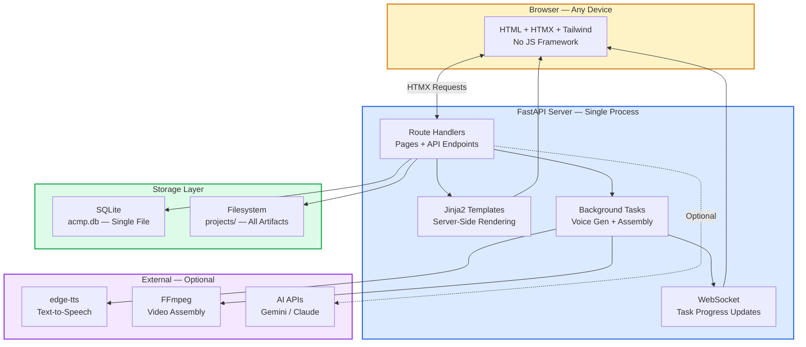
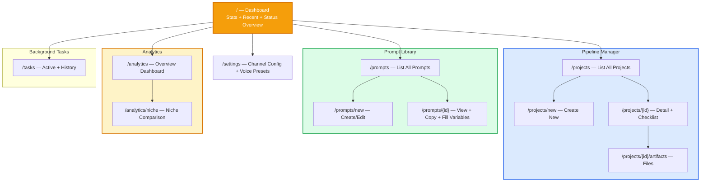
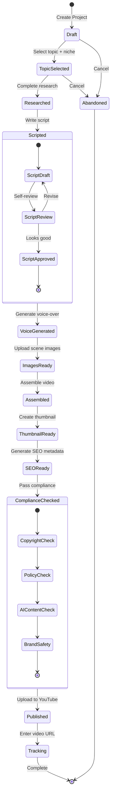
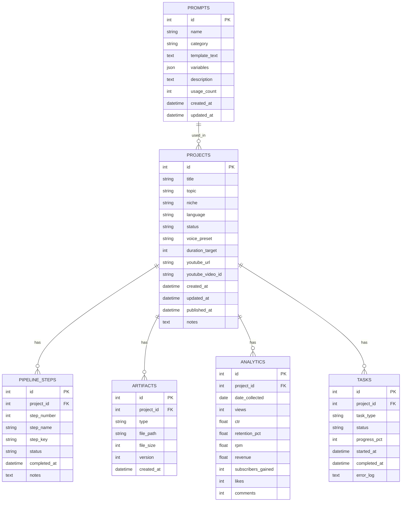
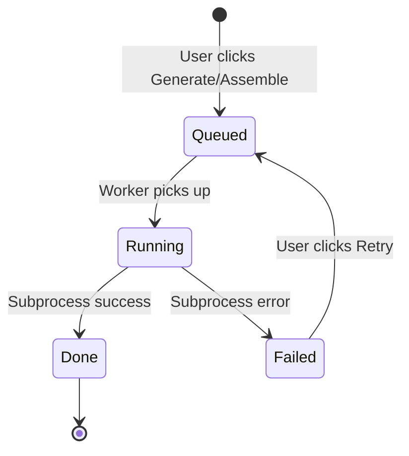

# ACMP Solo Web App
## Self-Hosted Dashboard — Build Plan & Implementation Spec

> **Mục tiêu:** 1 web app duy nhất thay thế toàn bộ CLI scripts + manual tracking.
> **Chạy trên:** Linux, SQLite, $5 VPS hoặc laptop cá nhân.
> **Build bằng:** Copilot Premium viết code + Claude Code generate modules.
> **Không cần:** React, Vue, Docker, PostgreSQL, Redis, Kubernetes.

---

## Table of Contents

| # | Section | Nội dung |
|---|---|---|
| 1 | [Product Overview](#1-product-overview) | What, Why, Core Capabilities, Principles |
| 2 | [Tech Stack Decision](#2-tech-stack-decision) | Why FastAPI + HTMX + SQLite |
| 3 | [Architecture](#3-architecture) | System diagram, Route map, State machine, Folder structure |
| 4 | [Database Schema](#4-database-schema) | SQLite tables, relationships, migrations |
| 5 | [Feature Spec — Dashboard](#5-feature-spec--dashboard) | Home, stats, recent activity |
| 6 | [Feature Spec — Pipeline Manager](#6-feature-spec--pipeline-manager) | Create, flow checklist, state transitions |
| 7 | [Feature Spec — Artifacts Manager](#7-feature-spec--artifacts-manager) | Upload, preview, version, download |
| 8 | [Feature Spec — Prompt Library](#8-feature-spec--prompt-library) | CRUD prompts, render with variables, copy button |
| 9 | [Feature Spec — Analytics](#9-feature-spec--analytics) | Performance tracking, charts, insights |
| 10 | [Feature Spec — Background Tasks](#10-feature-spec--background-tasks) | Voice gen, video assembly, async execution |
| 11 | [API Reference](#11-api-reference) | All routes, request/response |
| 12 | [Implementation Backlog](#12-implementation-backlog) | Sprint-level tasks, 4-week plan |
| 13 | [Deployment Guide](#13-deployment-guide) | Linux setup, systemd, nginx, backup |

---

## 1. Product Overview

### 1.1 What

Một **self-hosted web application** thay thế toàn bộ:

| Hiện tại (CLI + Manual) | Web App (bản mới) |
|---|---|
| 6 Python scripts riêng lẻ | 1 dashboard thống nhất |
| Terminal commands | Click-based UI |
| tracker.csv thủ công | SQLite + auto-tracking |
| Prompt templates trong .md files | Prompt library có search + variable fill |
| Artifacts nằm rải rác trong folders | Centralized file manager + preview |
| Không có overview | Dashboard với stats + charts |
| Không có checklist | Visual pipeline flow + checklist |

### 1.2 Why

- **Visibility:** Nhìn toàn bộ pipeline status trên 1 màn hình
- **Consistency:** Checklist đảm bảo không bỏ sót bước nào
- **Speed:** Click thay vì gõ commands
- **Data:** Track performance tự động, xem trends
- **Prompt Management:** Lưu, edit, render prompts có biến — không cần nhớ
- **Artifact Management:** Preview script, audio, images, video trong browser

### 1.3 Core Capabilities

| # | Capability | Description |
|---|---|---|
| C1 | **Dashboard** | Overview stats, recent projects, pipeline status, revenue chart |
| C2 | **Pipeline Manager** | Tạo project → visual checklist từng bước → mark done → track state |
| C3 | **Artifacts Manager** | Upload/download/preview script, audio, images, video, thumbnail, metadata |
| C4 | **Prompt Library** | CRUD prompt templates, variable substitution, 1-click copy, categorized |
| C5 | **Analytics** | Views, CTR, retention, RPM tracking per video, niche comparison, trend charts |
| C6 | **Background Tasks** | Run voice gen + video assembly từ UI, async với progress indicator |
| C7 | **Settings** | Channel config, voice presets, default niche, file paths |

### 1.4 Design Principles

| Principle | Detail |
|---|---|
| **Minimal dependencies** | Chỉ dùng packages thực sự cần. Không bloat. |
| **SQLite only** | Zero config database. Backup = copy 1 file. |
| **No SPA framework** | Server-side rendering + HTMX. Không React/Vue/Svelte. |
| **$5 VPS viable** | Chạy được trên 512MB RAM, 1 vCPU. |
| **Offline capable** | Hoạt động hoàn toàn offline (trừ AI API calls). |
| **Single binary deploy** | `git pull && pip install && systemctl restart` — done. |
| **AI-buildable** | Mọi module đủ nhỏ để Claude Code/Copilot generate 1 lần. |

---

## 2. Tech Stack Decision

### 2.1 Framework Comparison

| Criteria | Flask | FastAPI | Django |
|---|---|---|---|
| Async support | Partial (with extensions) | Native | Partial (4.0+) |
| Auto API docs | No | Yes (Swagger + ReDoc) | No |
| Template engine | Jinja2 | Jinja2 | Built-in (similar) |
| Learning curve | Low | Low | Medium-High |
| Background tasks | Need Celery/RQ | Built-in (BackgroundTasks) | Need Celery |
| File handling | Manual | Built-in (UploadFile) | Built-in |
| DB ORM | SQLAlchemy (separate) | SQLAlchemy (separate) | Built-in ORM |
| Overhead | Minimal | Minimal | Heavy |
| **Verdict** | Good | **Best fit** | Overkill |

### 2.2 Chosen Stack

| Layer | Technology | Why |
|---|---|---|
| **Backend** | FastAPI | Async, auto docs, modern, background tasks, consistent with existing scripts |
| **Templates** | Jinja2 | Server-side rendering, no JS build step, simple |
| **Interactivity** | HTMX | Partial page updates without writing JS, inline loading states |
| **Styling** | Tailwind CSS (CDN) | Beautiful UI, no CSS files to maintain, utility-first |
| **Icons** | Lucide (CDN) | Clean icons, no font files |
| **Charts** | Chart.js (CDN) | Simple, lightweight, sufficient for analytics |
| **Database** | SQLite (aiosqlite) | Zero config, single file, async support |
| **File Storage** | Local filesystem | Simple, predictable, easy backup |
| **Voice Gen** | edge-tts (subprocess) | Free, Microsoft, already proven |
| **Video Assembly** | FFmpeg (subprocess) | Free, local, already proven |
| **Task Queue** | FastAPI BackgroundTasks | No Redis/Celery needed, sufficient for solo use |

### 2.3 Dependencies (Minimal)

```
# requirements.txt
fastapi==0.115.*
uvicorn[standard]==0.30.*
jinja2==3.1.*
python-multipart==0.0.*
aiofiles==24.*
aiosqlite==0.20.*
edge-tts==6.*
```

**Total: 7 packages.** Không thêm gì khác.

### 2.4 System Requirements

| Requirement | Minimum | Recommended |
|---|---|---|
| OS | Any Linux (Ubuntu 22.04+ preferred) | Ubuntu 24.04 LTS |
| Python | 3.10+ | 3.12 |
| RAM | 512 MB | 1 GB |
| Disk | 5 GB (+ video storage) | 20 GB SSD |
| FFmpeg | Any version | 6.0+ |
| Network | Optional (for AI APIs) | Broadband |
| Cost | $0 (local) | $5/mo (Hetzner VPS) |

---

## 3. Architecture

### 3.1 System Architecture



### 3.2 Page / Route Map



### 3.3 Pipeline State Machine



### 3.4 Key Architecture Decisions

| Decision | Options Considered | Chosen | Why |
|---|---|---|---|
| Rendering | SPA (React/Vue) vs SSR (Jinja2) | **SSR + HTMX** | No build step, works without JS, faster to develop, AI-buildable |
| Database | PostgreSQL vs SQLite | **SQLite** | Zero config, backup = copy file, sufficient for solo (100K+ rows easy) |
| Task queue | Celery + Redis vs BackgroundTasks | **BackgroundTasks** | No extra process, no Redis, sufficient for 1 user |
| CSS | Custom CSS vs Tailwind vs Bootstrap | **Tailwind CDN** | Modern look, no build step, utility-first, fast prototyping |
| Interactivity | Vanilla JS vs HTMX vs Alpine.js | **HTMX** | Minimal JS, declarative, partial updates, inline loading states |
| File upload | Cloud storage vs local | **Local filesystem** | Simple, no cost, easy backup, sufficient for solo |
| Auth | JWT / sessions / none | **None (localhost) or basic HTTP auth** | Solo app, accessed locally or via VPN |

### 3.5 Project Folder Structure

```
acmp-webapp/
├── app/
│   ├── __init__.py
│   ├── main.py                 # FastAPI app + startup
│   ├── config.py               # Settings (paths, defaults)
│   ├── database.py             # SQLite connection + migrations
│   ├── models.py               # Pydantic models (request/response)
│   │
│   ├── routers/                # Route handlers (1 file per feature)
│   │   ├── __init__.py
│   │   ├── dashboard.py        # GET /
│   │   ├── projects.py         # /projects/*
│   │   ├── prompts.py          # /prompts/*
│   │   ├── analytics.py        # /analytics/*
│   │   ├── tasks.py            # /tasks/*
│   │   ├── settings.py         # /settings
│   │   └── api.py              # /api/* (HTMX partials + JSON endpoints)
│   │
│   ├── services/               # Business logic (no HTTP concerns)
│   │   ├── __init__.py
│   │   ├── project_service.py  # CRUD + state transitions
│   │   ├── prompt_service.py   # Prompt CRUD + variable rendering
│   │   ├── artifact_service.py # File management
│   │   ├── analytics_service.py# Stats calculation
│   │   ├── voice_service.py    # edge-tts wrapper
│   │   ├── assembly_service.py # FFmpeg wrapper
│   │   └── task_service.py     # Background task management
│   │
│   ├── templates/              # Jinja2 HTML templates
│   │   ├── base.html           # Layout: nav + sidebar + main
│   │   ├── components/         # Reusable HTMX partials
│   │   │   ├── project_card.html
│   │   │   ├── checklist_step.html
│   │   │   ├── stat_card.html
│   │   │   ├── prompt_card.html
│   │   │   ├── file_preview.html
│   │   │   ├── task_progress.html
│   │   │   └── toast.html
│   │   ├── dashboard.html
│   │   ├── projects/
│   │   │   ├── list.html
│   │   │   ├── new.html
│   │   │   ├── detail.html     # Main project view + checklist
│   │   │   └── artifacts.html
│   │   ├── prompts/
│   │   │   ├── list.html
│   │   │   ├── edit.html
│   │   │   └── view.html
│   │   ├── analytics/
│   │   │   ├── overview.html
│   │   │   └── niche.html
│   │   ├── tasks.html
│   │   └── settings.html
│   │
│   └── static/                 # Minimal static files
│       ├── logo.svg
│       └── custom.css          # <20 lines of overrides
│
├── data/
│   ├── acmp.db                 # SQLite database (auto-created)
│   └── backups/                # Auto-backup folder
│
├── projects/                   # All video project files
│   └── {project_id}/
│       ├── script.txt
│       ├── voice.mp3
│       ├── scenes/
│       ├── thumbnail.png
│       ├── metadata.json
│       └── final_video.mp4
│
├── seed/
│   └── prompts.json            # Default prompt templates (P-01 to P-10)
│
├── requirements.txt
├── run.py                      # Entry point: uvicorn runner
├── setup.sh                    # 1-command Linux setup
└── README.md
```

---

## 4. Database Schema

### 4.1 Entity Relationship



### 4.2 CREATE TABLE Statements

```sql
-- SQLite Schema for ACMP Solo Web App
-- Auto-created on first run via database.py

CREATE TABLE IF NOT EXISTS projects (
    id              INTEGER PRIMARY KEY AUTOINCREMENT,
    title           TEXT NOT NULL,
    topic           TEXT NOT NULL,
    niche           TEXT DEFAULT '',
    language        TEXT DEFAULT 'en',
    status          TEXT DEFAULT 'draft'
                    CHECK(status IN ('draft','in_progress','completed',
                                     'published','abandoned')),
    voice_preset    TEXT DEFAULT 'guy',
    duration_target INTEGER DEFAULT 480,   -- seconds
    youtube_url     TEXT DEFAULT '',
    youtube_video_id TEXT DEFAULT '',
    created_at      DATETIME DEFAULT CURRENT_TIMESTAMP,
    updated_at      DATETIME DEFAULT CURRENT_TIMESTAMP,
    published_at    DATETIME,
    notes           TEXT DEFAULT ''
);

CREATE TABLE IF NOT EXISTS pipeline_steps (
    id              INTEGER PRIMARY KEY AUTOINCREMENT,
    project_id      INTEGER NOT NULL REFERENCES projects(id) ON DELETE CASCADE,
    step_number     INTEGER NOT NULL,
    step_name       TEXT NOT NULL,
    step_key        TEXT NOT NULL,
    status          TEXT DEFAULT 'pending'
                    CHECK(status IN ('pending','in_progress','done','skipped')),
    completed_at    DATETIME,
    notes           TEXT DEFAULT ''
);
CREATE INDEX idx_steps_project ON pipeline_steps(project_id);

CREATE TABLE IF NOT EXISTS artifacts (
    id              INTEGER PRIMARY KEY AUTOINCREMENT,
    project_id      INTEGER NOT NULL REFERENCES projects(id) ON DELETE CASCADE,
    type            TEXT NOT NULL
                    CHECK(type IN ('script','voice','scene_image','thumbnail',
                                   'video','metadata','notes','other')),
    file_path       TEXT NOT NULL,
    file_size       INTEGER DEFAULT 0,
    version         INTEGER DEFAULT 1,
    created_at      DATETIME DEFAULT CURRENT_TIMESTAMP
);
CREATE INDEX idx_artifacts_project ON artifacts(project_id);

CREATE TABLE IF NOT EXISTS prompts (
    id              INTEGER PRIMARY KEY AUTOINCREMENT,
    name            TEXT NOT NULL,
    category        TEXT DEFAULT 'general'
                    CHECK(category IN ('research','script','visual','seo',
                                       'compliance','analysis','system','general')),
    template_text   TEXT NOT NULL,
    variables       TEXT DEFAULT '[]',   -- JSON array of variable names
    description     TEXT DEFAULT '',
    usage_count     INTEGER DEFAULT 0,
    created_at      DATETIME DEFAULT CURRENT_TIMESTAMP,
    updated_at      DATETIME DEFAULT CURRENT_TIMESTAMP
);

CREATE TABLE IF NOT EXISTS analytics (
    id              INTEGER PRIMARY KEY AUTOINCREMENT,
    project_id      INTEGER NOT NULL REFERENCES projects(id) ON DELETE CASCADE,
    date_collected  DATE NOT NULL,
    views           INTEGER DEFAULT 0,
    ctr             REAL DEFAULT 0.0,
    retention_pct   REAL DEFAULT 0.0,
    rpm             REAL DEFAULT 0.0,
    revenue         REAL DEFAULT 0.0,
    subscribers_gained INTEGER DEFAULT 0,
    likes           INTEGER DEFAULT 0,
    comments        INTEGER DEFAULT 0
);
CREATE INDEX idx_analytics_project ON analytics(project_id);

CREATE TABLE IF NOT EXISTS tasks (
    id              INTEGER PRIMARY KEY AUTOINCREMENT,
    project_id      INTEGER REFERENCES projects(id) ON DELETE SET NULL,
    task_type       TEXT NOT NULL
                    CHECK(task_type IN ('voice_gen','assembly','seo_gen',
                                        'thumbnail_gen','compliance_check')),
    status          TEXT DEFAULT 'queued'
                    CHECK(status IN ('queued','running','done','failed')),
    progress_pct    INTEGER DEFAULT 0,
    started_at      DATETIME,
    completed_at    DATETIME,
    error_log       TEXT DEFAULT ''
);

CREATE TABLE IF NOT EXISTS settings (
    key             TEXT PRIMARY KEY,
    value           TEXT DEFAULT ''
);

-- Default settings
INSERT OR IGNORE INTO settings (key, value) VALUES
    ('channel_name', ''),
    ('default_niche', 'history'),
    ('default_language', 'en'),
    ('default_voice', 'guy'),
    ('default_duration', '480'),
    ('projects_dir', './projects'),
    ('ffmpeg_path', 'ffmpeg'),
    ('auto_backup', 'true');
```

### 4.3 Default Pipeline Steps (seeded per project)

```python
# Mỗi khi tạo project mới, seed 11 steps này:
DEFAULT_PIPELINE_STEPS = [
    (1,  "Select Topic",       "topic_select"),
    (2,  "Research",           "research"),
    (3,  "Write Script",       "script"),
    (4,  "Generate Voice",     "voice"),
    (5,  "Create Images",      "images"),
    (6,  "Assemble Video",     "assembly"),
    (7,  "Create Thumbnail",   "thumbnail"),
    (8,  "SEO Metadata",       "seo"),
    (9,  "Compliance Check",   "compliance"),
    (10, "Publish",            "publish"),
    (11, "Track Performance",  "tracking"),
]
```

### 4.4 Migration Strategy

```python
# Simple version-based migration in database.py
SCHEMA_VERSION = 1

async def migrate(db):
    current = await db.execute("PRAGMA user_version")
    version = (await current.fetchone())[0]

    if version < 1:
        # Run initial schema creation
        await db.executescript(SCHEMA_SQL)
        await db.execute(f"PRAGMA user_version = {SCHEMA_VERSION}")
        await db.commit()
        print(f"[DB] Migrated to version {SCHEMA_VERSION}")

# Future migrations:
# if version < 2:
#     await db.execute('ALTER TABLE projects ADD COLUMN ...')
#     await db.execute('PRAGMA user_version = 2')
```

---

## 5. Feature Spec — Dashboard

### 5.1 Layout Wireframe

```
┌──────────────────────────────────────────────────────────────┐
│  ACMP Solo Dashboard                          [Settings] ⚙️  │
├──────────┬───────────────────────────────────────────────────┤
│          │                                                   │
│ SIDEBAR  │   ┌──────┐ ┌──────┐ ┌──────┐ ┌──────┐ ┌──────┐  │
│          │   │Total │ │This  │ │In-   │ │Publi-│ │Rev.  │  │
│ Dashboard│   │Videos│ │Month │ │Progr.│ │shed  │ │$xxx  │  │
│ Projects │   │  42  │ │  8   │ │  3   │ │  31  │ │$125  │  │
│ Prompts  │   └──────┘ └──────┘ └──────┘ └──────┘ └──────┘  │
│ Analytics│                                                   │
│ Tasks    │   ┌─────────────────────────────────────────────┐ │
│          │   │  Recent Projects                    [+New]  │ │
│          │   ├─────┬──────────────────┬───────┬────────────┤ │
│          │   │ Date│ Title            │Status │ Progress   │ │
│          │   ├─────┼──────────────────┼───────┼────────────┤ │
│          │   │06-16│ Ancient Egypt    │●Done  │ ████████ 9/11│
│          │   │06-15│ Black Holes      │●Pub   │ ████████████│ │
│          │   │06-14│ Stoicism Guide   │●Script│ ████░░░░ 3/11│
│          │   └─────┴──────────────────┴───────┴────────────┘ │
│          │                                                   │
│          │   ┌──────────────────────┐ ┌────────────────────┐ │
│          │   │ Pipeline Overview    │ │ Revenue (30 days) │ │
│          │   │ Draft:     2        │ │ [Chart.js bar]    │ │
│          │   │ In Progress: 3      │ │                    │ │
│          │   │ Published:  31      │ │                    │ │
│          │   │ Abandoned:  6       │ │                    │ │
│          │   └──────────────────────┘ └────────────────────┘ │
│          │                                                   │
└──────────┴───────────────────────────────────────────────────┘
```

### 5.2 HTMX Interactions

| Element | HTMX Attribute | Behavior |
|---|---|---|
| Stat cards | `hx-get="/api/stats" hx-trigger="every 30s"` | Auto-refresh stats every 30s |
| Project row | `hx-get="/projects/{id}" hx-push-url="true"` | Click → navigate to detail |
| [+New] button | `hx-get="/projects/new" hx-target="#modal"` | Open create form in modal |
| Revenue chart | `hx-get="/api/chart/revenue"` on load | Load chart data async |

### 5.3 SQL Queries

```sql
-- Stats cards
SELECT COUNT(*) as total FROM projects;
SELECT COUNT(*) as this_month FROM projects
  WHERE strftime('%Y-%m', created_at) = strftime('%Y-%m', 'now');
SELECT COUNT(*) as in_progress FROM projects WHERE status = 'in_progress';
SELECT COUNT(*) as published FROM projects WHERE status = 'published';
SELECT COALESCE(SUM(revenue), 0) as total_revenue FROM analytics;

-- Recent projects with progress
SELECT p.*, 
       COUNT(CASE WHEN ps.status = 'done' THEN 1 END) as steps_done,
       COUNT(ps.id) as steps_total
FROM projects p
LEFT JOIN pipeline_steps ps ON ps.project_id = p.id
GROUP BY p.id
ORDER BY p.created_at DESC
LIMIT 10;
```

---

## 6. Feature Spec — Pipeline Manager

### 6.1 Create New Project

**Form fields:**

| Field | Type | Required | Default |
|---|---|---|---|
| Title | text | Yes | — |
| Topic | text | Yes | — |
| Niche | dropdown | No | (from settings) |
| Language | dropdown | No | en |
| Duration target | number (seconds) | No | 480 |
| Voice preset | dropdown | No | guy |
| Notes | textarea | No | — |

**On submit:**
1. INSERT into `projects`
2. INSERT 11 rows into `pipeline_steps` (default steps)
3. Create project folder: `projects/{id}/scenes/`
4. Redirect to project detail page

### 6.2 Project Detail — Visual Pipeline Checklist

```
┌──────────────────────────────────────────────────────────────┐
│  Project: Ancient Egypt Secrets          Status: In Progress │
│  Niche: History | Language: EN | Target: 8 min              │
├──────────────────────────────────────────────────────────────┤
│                                                              │
│  Pipeline Progress  ████████████░░░░░░░░  7/11 (64%)        │
│                                                              │
│  ✅ 1. Select Topic          Done 2026-06-16 08:30          │
│     └─ Notes: High demand, medium competition               │
│                                                              │
│  ✅ 2. Research               Done 2026-06-16 08:40          │
│     └─ [View Research Notes]                                 │
│                                                              │
│  ✅ 3. Write Script           Done 2026-06-16 08:55          │
│     └─ 1,247 words | [View Script] [Edit] [Use Prompt P-02] │
│                                                              │
│  ✅ 4. Generate Voice         Done 2026-06-16 09:00          │
│     └─ voice.mp3 (4.2 MB) | [Play ▶] [Regenerate]          │
│                                                              │
│  ✅ 5. Create Images          Done 2026-06-16 09:20          │
│     └─ 12 images | [View Gallery] [Upload More]             │
│                                                              │
│  ✅ 6. Assemble Video         Done 2026-06-16 09:22          │
│     └─ final_video.mp4 (320 MB) | [Preview ▶] [Reassemble] │
│                                                              │
│  ✅ 7. Create Thumbnail       Done 2026-06-16 09:30          │
│     └─ thumbnail.png | [Preview] [Upload New]               │
│                                                              │
│  🔵 8. SEO Metadata           IN PROGRESS                    │
│     └─ [Use Prompt P-05] [Auto-Generate] [Edit JSON]        │
│                                                              │
│  ⬜ 9. Compliance Check       Pending                        │
│     └─ [Use Prompt P-07] [Run Checklist]                    │
│                                                              │
│  ⬜ 10. Publish               Pending                        │
│     └─ [Enter YouTube URL after upload]                     │
│                                                              │
│  ⬜ 11. Track Performance     Pending                        │
│     └─ [Enter Analytics] — available 24h after publish      │
│                                                              │
├──────────────────────────────────────────────────────────────┤
│  Artifacts: [script.txt] [voice.mp3] [12 images]            │
│             [final_video.mp4] [thumbnail.png] [metadata.json]│
│                                                              │
│  [Mark Current Step Done ✓]  [Skip Step ⏭]  [Add Note 📝]  │
└──────────────────────────────────────────────────────────────┘
```

### 6.3 Step Actions by Type

| Step | Key Actions in UI | Auto-Triggers |
|---|---|---|
| 1. Select Topic | Text input: topic, niche selector | — |
| 2. Research | Link to Prompt P-01, textarea for notes | — |
| 3. Write Script | Textarea editor, Prompt P-02 link, word count | Auto: save to script.txt |
| 4. Generate Voice | Voice preset selector, [Generate] button | Background task: edge-tts |
| 5. Create Images | File uploader (multi), Prompt P-03 link, gallery | Auto: save to scenes/ |
| 6. Assemble Video | [Assemble] button, resolution selector | Background task: FFmpeg |
| 7. Thumbnail | File uploader, Prompt P-04 link, preview | Auto: save thumbnail.png |
| 8. SEO Metadata | JSON editor, Prompt P-05 link, [Auto-Generate] | Auto: save metadata.json |
| 9. Compliance | Interactive checklist (6 items), Prompt P-07 link | Auto: calculate pass/fail |
| 10. Publish | YouTube URL input, date picker | Auto: update project status |
| 11. Track | Analytics form (views, CTR, etc.), recurring entry | Auto: save to analytics table |

### 6.4 State Transition Rules

```python
# Rules for step completion
STEP_RULES = {
    "topic_select": {"requires": [], "auto_next": True},
    "research":     {"requires": ["topic_select"], "auto_next": True},
    "script":       {"requires": ["research"],
                     "artifact_required": "script"},
    "voice":        {"requires": ["script"],
                     "artifact_required": "voice",
                     "can_auto_run": True},
    "images":       {"requires": ["script"],
                     "artifact_required": "scene_image",
                     "min_artifacts": 3},
    "assembly":     {"requires": ["voice", "images"],
                     "artifact_required": "video",
                     "can_auto_run": True},
    "thumbnail":    {"requires": ["assembly"],
                     "artifact_required": "thumbnail"},
    "seo":          {"requires": ["script"],
                     "artifact_required": "metadata"},
    "compliance":   {"requires": ["assembly", "seo"]},
    "publish":      {"requires": ["compliance"],
                     "field_required": "youtube_url"},
    "tracking":     {"requires": ["publish"]},
}
```

### 6.5 HTMX Interactions

| Action | HTMX | Behavior |
|---|---|---|
| Mark step done | `hx-post="/api/projects/{id}/steps/{step_id}/complete"` | Partial update: step turns green, next step unlocks |
| Skip step | `hx-post="/api/projects/{id}/steps/{step_id}/skip"` | Partial update: step greyed out, next unlocks |
| Add note | `hx-post="/api/projects/{id}/steps/{step_id}/note"` | Inline save, no page reload |
| Generate voice | `hx-post="/api/projects/{id}/generate-voice"` | Show spinner, poll progress via WebSocket |
| Assemble video | `hx-post="/api/projects/{id}/assemble"` | Show spinner, poll progress via WebSocket |
| Upload file | `hx-post="/api/projects/{id}/upload"` enctype multipart | File uploaded, artifact created, preview shown |

---

## 7. Feature Spec — Artifacts Manager

### 7.1 Capabilities

| Artifact Type | Upload | Preview | Auto-Created | Versioned |
|---|---|---|---|---|
| `script` | Paste text / file upload | Inline text with word count | Via script editor | Yes |
| `voice` | Upload .mp3 | Audio player `<audio>` inline | Via Generate Voice task | Yes |
| `scene_image` | Multi-file upload / drag-drop | Image gallery grid | — | No (append) |
| `thumbnail` | Upload .png/.jpg | Image preview | — | Yes |
| `video` | — (auto-generated) | Video player `<video>` inline | Via Assembly task | Yes |
| `metadata` | Edit JSON | Formatted key-value view | Via SEO Generate | Yes |

### 7.2 Image Gallery (scenes)

```
┌──────────────────────────────────────────────────────────┐
│  Scene Images (12)                  [Upload More] [↕Sort]│
├──────────┬──────────┬──────────┬──────────┬─────────────┤
│ scene_01 │ scene_02 │ scene_03 │ scene_04 │             │
│ [image]  │ [image]  │ [image]  │ [image]  │             │
│ [✕ Del]  │ [✕ Del]  │ [✕ Del]  │ [✕ Del]  │             │
├──────────┼──────────┼──────────┼──────────┤  Drop files │
│ scene_05 │ scene_06 │ scene_07 │ scene_08 │  here to    │
│ [image]  │ [image]  │ [image]  │ [image]  │  upload     │
│ [✕ Del]  │ [✕ Del]  │ [✕ Del]  │ [✕ Del]  │             │
├──────────┼──────────┼──────────┼──────────┤             │
│ scene_09 │ scene_10 │ scene_11 │ scene_12 │             │
│ [image]  │ [image]  │ [image]  │ [image]  │             │
│ [✕ Del]  │ [✕ Del]  │ [✕ Del]  │ [✕ Del]  │             │
└──────────┴──────────┴──────────┴──────────┴─────────────┘
```

### 7.3 HTMX Interactions

| Action | HTMX | Notes |
|---|---|---|
| Upload file(s) | `hx-post="/api/projects/{id}/upload" hx-encoding="multipart/form-data"` | Drag-drop zone, multi-file |
| Delete artifact | `hx-delete="/api/artifacts/{id}" hx-confirm="Delete?"` | Remove from gallery, delete file |
| Preview audio | Native `<audio controls src="/files/{path}">` | No HTMX needed |
| Preview video | Native `<video controls src="/files/{path}">` | No HTMX needed |
| Sort images | `hx-post="/api/projects/{id}/sort-images"` + Sortable.js | Drag to reorder |

---

## 8. Feature Spec — Prompt Library

### 8.1 Wireframe

```
┌──────────────────────────────────────────────────────────┐
│  Prompt Library                               [+ New] 📝 │
├──────────────────────────────────────────────────────────┤
│  Filter: [All ▼] [research] [script] [visual] [seo]     │
│                  [compliance] [analysis] [system]        │
├──────────────────────────────────────────────────────────┤
│                                                          │
│  P-01: Topic Research                      [research]    │
│  Research a topic for YouTube documentary video          │
│  Variables: [TOPIC] [NICHE] [AUDIENCE] [DURATION]        │
│  Used: 47 times                                          │
│  [Open ▶] [Copy 📋] [Edit ✏️] [Use for Project ▶]       │
│  ────────────────────────────────────────────────────     │
│                                                          │
│  P-02: Script Writing                      [script]      │
│  Write a complete narration script                       │
│  Variables: [TOPIC] [DURATION] [STYLE] [RESEARCH_NOTES]  │
│  Used: 42 times                                          │
│  [Open ▶] [Copy 📋] [Edit ✏️] [Use for Project ▶]       │
│  ────────────────────────────────────────────────────     │
│                                                          │
│  ...                                                     │
└──────────────────────────────────────────────────────────┘
```

### 8.2 Prompt Detail / Render View

```
┌──────────────────────────────────────────────────────────┐
│  P-02: Script Writing                           [Edit ✏️] │
├──────────────────────────────────────────────────────────┤
│  Category: script | Used: 42 times                       │
│                                                          │
│  Fill Variables:                                          │
│  TOPIC:    [Ancient Egypt Pyramids          ]            │
│  DURATION: [8 minutes                       ]            │
│  STYLE:    [Documentary      ▼]                          │
│  RESEARCH: [paste research notes here...    ]            │
│            [                                ]            │
│                                                          │
│  [Render Prompt ▶]                                       │
│                                                          │
│  ┌────────────────────────────────────────────────────┐  │
│  │ ROLE: You are a world-class documentary script     │  │
│  │ writer who creates binge-worthy narration...       │  │
│  │                                                    │  │
│  │ Topic: Ancient Egypt Pyramids                      │  │
│  │ Duration Target: 8 minutes (~1,200 words)          │  │
│  │ Style: Documentary                                 │  │
│  │ ...                                                │  │
│  └────────────────────────────────────────────────────┘  │
│                                                          │
│  [Copy Rendered Prompt 📋]  [Open in Claude ↗]           │
└──────────────────────────────────────────────────────────┘
```

### 8.3 Prompt Rendering Logic

```python
def render_prompt(template_text: str, variables: dict) -> str:
    """Replace [VARIABLE] placeholders with actual values."""
    result = template_text
    for key, value in variables.items():
        result = result.replace(f'[{key.upper()}]', str(value))
    return result

# Example:
# template = "Research [TOPIC] for [AUDIENCE]"
# variables = {"topic": "Pyramids", "audience": "US adults"}
# output = "Research Pyramids for US adults"
```

### 8.4 Seed Data (P-01 to P-10)

> All 10 prompts from Section 6 of the Playbook are auto-seeded on first run.
> See `database.py` → `seed_prompts()` function.
> Users can add, edit, delete, and create custom prompts.

---

## 9. Feature Spec — Analytics

### 9.1 Per-Video Analytics Entry

| Field | Type | Source |
|---|---|---|
| Date collected | date | Manual / current date |
| Views | int | YouTube Studio |
| CTR | float (%) | YouTube Studio |
| Avg retention | float (%) | YouTube Studio |
| RPM | float ($) | YouTube Studio |
| Revenue | float ($) | YouTube Studio |
| Subscribers gained | int | YouTube Studio |
| Likes | int | YouTube Studio |
| Comments | int | YouTube Studio |

> **Phase 2+ idea:** Auto-fetch from YouTube Analytics API via background task.

### 9.2 Analytics Dashboard

```
┌────────────────────────────────────────────────────────┐
│  Analytics Overview              Period: [Last 30 days▼]│
├────────────────────────────────────────────────────────┤
│                                                        │
│  Total Views: 45,230  |  Avg CTR: 5.2%                │
│  Total Revenue: $125  |  Avg RPM: $3.40               │
│  Avg Retention: 42%   |  New Subscribers: 320         │
│                                                        │
│  ┌──────────────────────────────────────────────────┐  │
│  │  Views per Video (last 20 videos)                │  │
│  │  [Bar chart via Chart.js]                        │  │
│  └──────────────────────────────────────────────────┘  │
│                                                        │
│  ┌──────────────────────┐ ┌────────────────────────┐  │
│  │ RPM by Niche         │ │ Top 5 Videos           │  │
│  │ History:    $4.20    │ │ 1. Pyramids:  8,230    │  │
│  │ Science:    $3.80    │ │ 2. Black Holes: 6,120  │  │
│  │ Psychology: $3.10    │ │ 3. Stoicism:  5,840    │  │
│  └──────────────────────┘ └────────────────────────┘  │
└────────────────────────────────────────────────────────┘
```

### 9.3 SQL Queries

```sql
-- Overview stats (last 30 days)
SELECT SUM(views) as total_views,
       AVG(ctr) as avg_ctr,
       AVG(retention_pct) as avg_retention,
       AVG(rpm) as avg_rpm,
       SUM(revenue) as total_revenue,
       SUM(subscribers_gained) as total_subs
FROM analytics a
JOIN projects p ON p.id = a.project_id
WHERE a.date_collected >= date('now', '-30 days');

-- RPM by niche
SELECT p.niche, AVG(a.rpm) as avg_rpm, COUNT(DISTINCT p.id) as videos
FROM analytics a JOIN projects p ON p.id = a.project_id
GROUP BY p.niche ORDER BY avg_rpm DESC;

-- Top performers
SELECT p.title, MAX(a.views) as max_views, MAX(a.revenue) as max_rev
FROM analytics a JOIN projects p ON p.id = a.project_id
GROUP BY p.id ORDER BY max_views DESC LIMIT 10;
```

---

## 10. Feature Spec — Background Tasks

### 10.1 Task Types

| Task Type | What it does | Command | Duration |
|---|---|---|---|
| `voice_gen` | Generate voice-over from script.txt | `edge-tts` subprocess | 10-60s |
| `assembly` | Assemble video from scenes/ + voice.mp3 | `ffmpeg` subprocess | 60-180s |
| `seo_gen` | Generate metadata template from script | Python function (no API) | <1s |

### 10.2 Task Lifecycle



### 10.3 Implementation Pattern

```python
import asyncio
import subprocess
from datetime import datetime

async def run_voice_generation(project_id: int, db):
    """Background task: generate voice-over."""
    # 1. Create task record
    task_id = await create_task(db, project_id, 'voice_gen')
    await update_task(db, task_id, status='running')

    try:
        project = await get_project(db, project_id)
        script_path = f'projects/{project_id}/script.txt'
        output_path = f'projects/{project_id}/voice.mp3'

        # 2. Run edge-tts as subprocess
        voice_id = VOICES.get(project['voice_preset'], 'en-US-GuyNeural')
        proc = await asyncio.create_subprocess_exec(
            'edge-tts',
            '--voice', voice_id,
            '--file', script_path,
            '--write-media', output_path,
            stdout=asyncio.subprocess.PIPE,
            stderr=asyncio.subprocess.PIPE
        )
        stdout, stderr = await proc.communicate()

        if proc.returncode == 0:
            # 3. Create artifact record
            file_size = os.path.getsize(output_path)
            await create_artifact(db, project_id, 'voice', output_path, file_size)
            await update_task(db, task_id, status='done', progress=100)
            await complete_step(db, project_id, 'voice')
        else:
            await update_task(db, task_id, status='failed',
                              error_log=stderr.decode())
    except Exception as e:
        await update_task(db, task_id, status='failed', error_log=str(e))
```

### 10.4 Progress Tracking via SSE

```python
# Server-sent events endpoint for real-time progress
@app.get('/api/tasks/{task_id}/stream')
async def task_stream(task_id: int):
    async def event_generator():
        while True:
            task = await get_task(db, task_id)
            yield f'data: {json.dumps(task)}\n\n'
            if task['status'] in ('done', 'failed'):
                break
            await asyncio.sleep(1)

    return StreamingResponse(event_generator(),
                             media_type='text/event-stream')
```

```html
<!-- Client: HTMX SSE listener -->
<div hx-ext="sse" sse-connect="/api/tasks/{task_id}/stream"
     sse-swap="message" hx-swap="innerHTML">
    <div class='animate-pulse'>Generating voice...</div>
</div>
```

---

## 11. API & Route Reference

### 11.1 Pages (HTML — Server-Side Rendered)

| Method | Path | Description |
|---|---|---|
| GET | `/` | Dashboard (home page) |
| GET | `/projects` | Project list with filters |
| GET | `/projects/new` | Create new project form |
| GET | `/projects/{id}` | Project detail + pipeline checklist |
| GET | `/projects/{id}/edit` | Edit project settings |
| GET | `/prompts` | Prompt library |
| GET | `/prompts/{id}` | Prompt detail + render view |
| GET | `/prompts/new` | Create new prompt form |
| GET | `/prompts/{id}/edit` | Edit prompt |
| GET | `/analytics` | Analytics overview |
| GET | `/analytics/{project_id}` | Per-video analytics |
| GET | `/tasks` | Background task list |
| GET | `/settings` | App settings page |

### 11.2 API Endpoints (JSON)

| Method | Path | Description |
|---|---|---|
| GET | `/api/stats` | Dashboard stat cards data |
| GET | `/api/chart/revenue` | Revenue chart data (Chart.js) |
| GET | `/api/chart/views` | Views chart data |
| POST | `/api/projects` | Create project (JSON body) |
| PUT | `/api/projects/{id}` | Update project |
| DELETE | `/api/projects/{id}` | Delete project + artifacts |
| POST | `/api/projects/{id}/upload` | Upload artifact file(s) |
| POST | `/api/projects/{id}/generate-voice` | Trigger voice gen task |
| POST | `/api/projects/{id}/assemble` | Trigger video assembly task |
| POST | `/api/projects/{id}/generate-seo` | Generate SEO metadata |
| POST | `/api/prompts` | Create prompt |
| PUT | `/api/prompts/{id}` | Update prompt |
| DELETE | `/api/prompts/{id}` | Delete prompt |
| POST | `/api/prompts/{id}/render` | Render prompt with variables |
| POST | `/api/analytics/{project_id}` | Add analytics entry |
| GET | `/api/tasks/{task_id}/stream` | SSE task progress stream |

### 11.3 HTMX Partial Endpoints

| Method | Path | Returns | Triggered by |
|---|---|---|---|
| GET | `/htmx/stats` | Stat cards HTML fragment | Dashboard auto-refresh |
| GET | `/htmx/projects/recent` | Recent projects table rows | Dashboard |
| POST | `/htmx/steps/{step_id}/complete` | Updated step row HTML | Mark step done button |
| POST | `/htmx/steps/{step_id}/skip` | Updated step row HTML | Skip step button |
| POST | `/htmx/steps/{step_id}/note` | Updated note HTML | Add note form |
| GET | `/htmx/projects/{id}/artifacts` | Artifacts list HTML | After upload |
| GET | `/htmx/tasks/{task_id}/status` | Task status badge HTML | Progress polling |

---

## 12. Implementation Backlog — 4-Week Build Plan

> **Total effort:** ~60-80 giờ
> **AI assist:** Dùng Claude Code / Copilot Premium viết 70-80% code
> **Approach:** Ship usable version mỗi tuần

### Week 1 — Foundation + Dashboard
> **Goal:** App chạy, có Dashboard, nhìn thấy projects.

| ID | Task | Hours | Module | Depends |
|---|---|---|---|---|
| W1.1 | Init FastAPI project, folder structure, `pyproject.toml` | 1h | scaffold | — |
| W1.2 | Setup SQLite + `database.py` (all CREATE TABLE, migrations) | 2h | database | — |
| W1.3 | Base Jinja2 layout (Tailwind CDN, sidebar nav, header) | 2h | templates | W1.1 |
| W1.4 | Dashboard page: stat cards + recent projects table | 3h | dashboard | W1.2, W1.3 |
| W1.5 | HTMX setup + auto-refresh stat cards every 30s | 1h | dashboard | W1.4 |
| W1.6 | Static file serving (`/files/` route for project assets) | 1h | core | W1.1 |
| W1.7 | Settings page (key-value store: voice preset, default niche) | 1h | settings | W1.2 |
| **Total** | | **11h** | | |

**Claude Code prompt for Week 1:**
```
Build a FastAPI web application with:
- SQLite database using aiosqlite
- Jinja2 templates with Tailwind CSS via CDN and HTMX
- Base layout with sidebar navigation: Dashboard, Projects, Prompts, Analytics, Tasks, Settings
- Dashboard page showing: stat cards (total videos, in-progress, published, revenue this month)
  and a table of 10 most recent projects
- All database schema as defined (projects, pipeline_steps, artifacts, prompts, analytics, tasks, settings)
- seed_database() function that populates default pipeline steps and 10 prompt templates
- Use async throughout
```

### Week 2 — Projects + Pipeline + Artifacts
> **Goal:** Tạo project, theo dõi pipeline, upload files.

| ID | Task | Hours | Module | Depends |
|---|---|---|---|---|
| W2.1 | Project list page (filter by status, niche) | 2h | projects | W1.2 |
| W2.2 | New Project form + auto-create pipeline steps | 2h | projects | W1.2 |
| W2.3 | Project Detail page: visual pipeline checklist (11 steps) | 4h | pipeline | W2.2 |
| W2.4 | HTMX: mark step done / skip → partial update | 2h | pipeline | W2.3 |
| W2.5 | Step detail panel: show relevant actions per step | 2h | pipeline | W2.3 |
| W2.6 | Artifact upload (multi-file, drag-drop area) | 3h | artifacts | W2.2 |
| W2.7 | Artifact preview (text, audio player, image gallery, video) | 3h | artifacts | W2.6 |
| W2.8 | Script editor (textarea with save, word count) | 1h | artifacts | W2.2 |
| **Total** | | **19h** | | |

**Claude Code prompt for Week 2:**
```
Add project management to the FastAPI app:
- Project CRUD: list with filters, create with form, detail view, edit, delete
- Pipeline checklist on project detail: 11 steps (topic_select through tracking)
  displayed as vertical step indicator with status badges (pending/in_progress/done/skipped)
- HTMX interactions: click 'Complete' button on a step → POST to mark done →
  return updated step HTML partial (no full page reload)
- Only current step can be completed, completing auto-unlocks next step
- File upload: multipart form with drag-drop zone for images, scripts, thumbnails
- Inline previews: <audio> for .mp3, <video> for .mp4,  grid for images,
  syntax-highlighted text for .txt/.json
- Each step shows relevant action buttons (e.g. voice step shows Generate Voice button)
```

### Week 3 — Prompts + Background Tasks
> **Goal:** Prompt library hoạt động, tự động generate voice + video.

| ID | Task | Hours | Module | Depends |
|---|---|---|---|---|
| W3.1 | Prompt Library page: list, filter by category | 2h | prompts | W1.2 |
| W3.2 | Prompt CRUD: create, edit, delete | 2h | prompts | W3.1 |
| W3.3 | Prompt Render: variable form → rendered text → copy button | 3h | prompts | W3.2 |
| W3.4 | Seed 10 prompts (P-01 to P-10) on first run | 1h | prompts | W3.2 |
| W3.5 | Background task: voice generation (edge-tts subprocess) | 3h | tasks | W2.5 |
| W3.6 | Background task: video assembly (FFmpeg subprocess) | 3h | tasks | W2.5 |
| W3.7 | Task progress: SSE endpoint + HTMX live update | 2h | tasks | W3.5, W3.6 |
| W3.8 | Task list page: active tasks + history | 1h | tasks | W3.5 |
| W3.9 | Connect pipeline steps: 'Generate Voice' button triggers task | 1h | integration | W2.4, W3.5 |
| **Total** | | **18h** | | |

**Claude Code prompt for Week 3:**
```
Add prompt library and background tasks:

Prompt Library:
- CRUD pages for prompts (name, category, template_text, variables JSON, description)
- Render view: parse [VARIABLE] placeholders from template, show input form,
  render filled prompt, 1-click copy to clipboard via navigator.clipboard.writeText()
- Categories: research, script, visual, seo, compliance, analysis, system
- Seed 10 prompts on first startup

Background Tasks:
- Voice Generation: run edge-tts as async subprocess, create artifact on success
- Video Assembly: run FFmpeg as async subprocess, create artifact on success
- SSE endpoint for real-time progress updates
- HTMX SSE extension to show live progress in the UI
- Task lifecycle: queued → running → done/failed, with retry button on failure
- Auto-complete the pipeline step when task succeeds
```

### Week 4 — Analytics + Polish + Deploy
> **Goal:** Analytics dashboard, polish UI, deploy lên VPS.

| ID | Task | Hours | Module | Depends |
|---|---|---|---|---|
| W4.1 | Analytics entry form: per-video metrics input | 2h | analytics | W1.2 |
| W4.2 | Analytics overview: summary stats + Chart.js graphs | 3h | analytics | W4.1 |
| W4.3 | Niche comparison + top/bottom performers tables | 2h | analytics | W4.1 |
| W4.4 | SEO metadata generator (local, no API) | 1h | features | W2.2 |
| W4.5 | Compliance checklist page (per project) | 1h | features | W2.3 |
| W4.6 | Polish: error handling, flash messages, loading states | 2h | polish | All |
| W4.7 | Mobile responsive tweaks | 1h | polish | W1.3 |
| W4.8 | Write setup.sh + systemd service + nginx config | 2h | deploy | All |
| W4.9 | SQLite backup cron script | 1h | deploy | W1.2 |
| W4.10 | README.md with screenshots + usage guide | 2h | docs | All |
| **Total** | | **17h** | | |

### Effort Summary

| Week | Focus | Hours | Cumulative |
|---|---|---|---|
| 1 | Foundation + Dashboard | 11h | 11h |
| 2 | Projects + Pipeline + Artifacts | 19h | 30h |
| 3 | Prompts + Background Tasks | 18h | 48h |
| 4 | Analytics + Polish + Deploy | 17h | **65h** |

> **Với Claude Code / Copilot assist:** Giảm ~40% → thực tế **~40 giờ** (~10 giờ/tuần)

---

## 13. Deployment Guide

### 13.1 Quick Setup Script (`setup.sh`)

```bash
#!/bin/bash
# ACMP Solo Web App — Quick Setup
# Run: chmod +x setup.sh && ./setup.sh

set -e

echo '=== ACMP Solo Web App Setup ==='

# 1. System dependencies
sudo apt update && sudo apt install -y python3.11 python3.11-venv ffmpeg nginx certbot python3-certbot-nginx

# 2. Create app directory
APP_DIR=/opt/acmp
sudo mkdir -p $APP_DIR
sudo chown $USER:$USER $APP_DIR
cd $APP_DIR

# 3. Clone or copy app files
# git clone https://your-repo.git . || echo 'Copy files manually to /opt/acmp'

# 4. Python virtual environment
python3.11 -m venv venv
source venv/bin/activate

# 5. Install dependencies
pip install fastapi uvicorn[standard] jinja2 python-multipart aiofiles aiosqlite edge-tts

# 6. Create directories
mkdir -p data projects static templates

# 7. Initialize database
python -c 'from database import init_db; import asyncio; asyncio.run(init_db())'

# 8. Create .env file
cat > .env << EOF
APP_HOST=0.0.0.0
APP_PORT=8000
DATABASE_PATH=data/acmp.db
PROJECTS_DIR=projects
SECRET_KEY=$(python -c 'import secrets; print(secrets.token_hex(32))')
EOF

echo '=== Setup complete ==='
echo 'Run: source venv/bin/activate && uvicorn main:app --host 0.0.0.0 --port 8000'
```

### 13.2 Systemd Service (`/etc/systemd/system/acmp.service`)

```ini
[Unit]
Description=ACMP Solo Web App
After=network.target

[Service]
Type=simple
User=acmp
Group=acmp
WorkingDirectory=/opt/acmp
Environment=PATH=/opt/acmp/venv/bin:/usr/bin
EnvironmentFile=/opt/acmp/.env
ExecStart=/opt/acmp/venv/bin/uvicorn main:app --host 0.0.0.0 --port 8000
Restart=always
RestartSec=5

[Install]
WantedBy=multi-user.target
```

```bash
# Enable and start
sudo systemctl daemon-reload
sudo systemctl enable acmp
sudo systemctl start acmp
sudo systemctl status acmp
```

### 13.3 Nginx Reverse Proxy (`/etc/nginx/sites-available/acmp`)

```nginx
server {
    listen 80;
    server_name acmp.yourdomain.com;  # hoặc IP address

    client_max_body_size 500M;  # Allow large video uploads

    location / {
        proxy_pass http://127.0.0.1:8000;
        proxy_set_header Host $host;
        proxy_set_header X-Real-IP $remote_addr;
        proxy_set_header X-Forwarded-For $proxy_add_x_forwarded_for;
        proxy_set_header X-Forwarded-Proto $scheme;
    }

    # SSE support (no buffering)
    location /api/tasks/ {
        proxy_pass http://127.0.0.1:8000;
        proxy_set_header Host $host;
        proxy_buffering off;
        proxy_cache off;
    }

    # Static files (cache)
    location /static/ {
        alias /opt/acmp/static/;
        expires 7d;
    }

    # Project files (audio, video, images)
    location /files/ {
        alias /opt/acmp/projects/;
        expires 1d;
    }
}
```

```bash
# Enable site + SSL
sudo ln -s /etc/nginx/sites-available/acmp /etc/nginx/sites-enabled/
sudo nginx -t && sudo systemctl reload nginx

# Optional: SSL with Let's Encrypt
sudo certbot --nginx -d acmp.yourdomain.com
```

### 13.4 SQLite Backup (Cron)

```bash
# Add to crontab: crontab -e
# Daily backup at 3 AM
0 3 * * * /opt/acmp/venv/bin/python -c "
import sqlite3, shutil, datetime;
src='/opt/acmp/data/acmp.db';
dst=f'/opt/acmp/data/backups/acmp_{datetime.date.today()}.db';
shutil.copy2(src, dst)
" && find /opt/acmp/data/backups -mtime +30 -delete
```

> **Backup = copy 1 file.** Đây là ưu điểm lớn nhất của SQLite. Restore = copy file back.

### 13.5 Quick Commands Reference

```bash
# Start/Stop/Restart
sudo systemctl start acmp
sudo systemctl stop acmp
sudo systemctl restart acmp

# View logs
sudo journalctl -u acmp -f

# Database backup (manual)
cp /opt/acmp/data/acmp.db /opt/acmp/data/backups/acmp_manual_$(date +%F).db

# Database size check
du -h /opt/acmp/data/acmp.db

# Disk usage
du -sh /opt/acmp/projects/

# Update app
cd /opt/acmp && git pull && sudo systemctl restart acmp
```

---

## Summary

### Bạn sẽ build:

| Component | Tech | Chức năng |
|---|---|---|
| **Dashboard** | FastAPI + Jinja2 + HTMX | Tổng quan stats, recent projects, revenue |
| **Pipeline Manager** | HTMX partial updates | 11-step visual checklist, state management |
| **Artifacts Manager** | File upload + inline preview | Script editor, audio/video player, image gallery |
| **Prompt Library** | CRUD + variable rendering | 10 seed prompts, copy-paste, usage tracking |
| **Background Tasks** | asyncio + subprocess | Voice gen (edge-tts), Video assembly (FFmpeg) |
| **Analytics** | Chart.js + SQL aggregation | Views, CTR, RPM, revenue, niche comparison |
| **Deployment** | systemd + nginx + certbot | 1-command setup, auto-start, SSL, daily backup |

### Tech Stack tóm tắt:

```
Backend:    FastAPI + Python 3.11
Database:   SQLite (1 file, zero config)
Templates:  Jinja2 + Tailwind CSS (CDN)
Interactivity: HTMX (no React/Vue/Angular)
Charts:     Chart.js (CDN)
Tasks:      asyncio subprocess (edge-tts, FFmpeg)
Deploy:     systemd + nginx + certbot
Backup:     cron + cp (SQLite = 1 file)
Cost:       $0 (local) or $5/mo (VPS)
```

### Next Steps

| Action | Command |
|---|---|
| Start building Week 1 | `"next: code week1"` — Generate toàn bộ scaffold code |
| Generate full database.py | `"next: database"` — All tables + seeds + migrations |
| Generate all templates | `"next: templates"` — Jinja2 base layout + all pages |
| Skip to deployable MVP | `"next: full-app"` — Entire app code in 1 output |

---

> **Build time:** ~40 giờ (with AI assist) = 1 tuần full-time hoặc 4 tuần part-time
> **Run cost:** $0 (local) hoặc $5/tháng (Hetzner VPS)
> **Backup:** Copy 1 file SQLite. Done.
> **Scale:** Đủ cho 1,000+ videos. Khi cần hơn → migrate to PostgreSQL.

---

*End of Document — ACMP Solo Web App Plan v1.0*