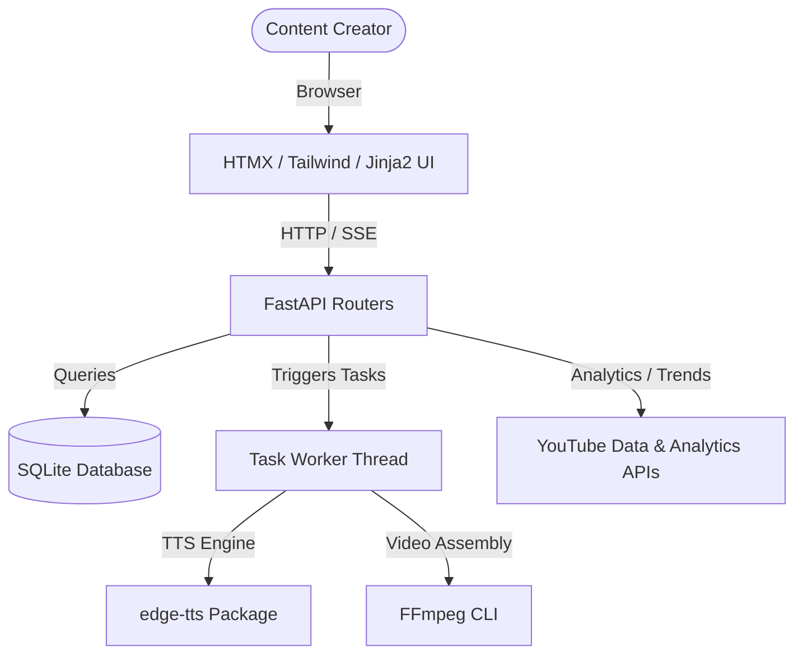

# ACMP Solo WebApp — Project Memories (HLD/LLD)

This is the central design and implementation reference for the ACMP (Automated Content Creation & Management Platform) Solo WebApp. Refer to this document before editing the codebase, and keep it updated as the project evolves.

---

## 1. Overview & Goal

The ACMP Solo WebApp is a self-hosted dashboard built for a single content creator. It replaces scattered CLI scripts to manage a complete YouTube faceless video production pipeline:
`Topic Selection → Research → Scriptwriting → Voice Generation → Video Assembly → SEO optimization → Platform Publishing → Performance Tracking`.

The design optimizes for:

- **Visual Clarity:** A single, responsive screen to manage a project's state through its 11-step pipeline.
- **Background Worker Status:** Real-time updates using Server-Sent Events (SSE) for voice generation and video assembly.
- **Premium Aesthetics:** Professional dark-mode design matching top landing pages, avoiding generic AI layouts.

---

## 2. High-Level Design (HLD)

### 2.1 Tech Stack

- **Backend:** FastAPI (Python 3.10+) — high performance, async-first.
- **Frontend:** Jinja2 templates, HTMX (for AJAX-driven, page-less reactivity), Tailwind CSS (CDN, carefully customized), Lucide Icons, and Chart.js.
- **Database:** SQLite (managed via asynchronous connections using `aiosqlite`).
- **Media Tools:** `FFmpeg` (local binary for video composition) and `edge-tts` (Microsoft Edge Text-to-Speech).

### 2.2 System Modules & Architecture



### 2.3 Directory Structure

```
ACMP/
├── app/
│   ├── __init__.py
│   ├── main.py             # FastAPI App entry & config
│   ├── database.py         # aiosqlite connection and tables initialization
│   ├── config.py           # App configuration, folders, binaries
│   ├── models.py           # Pydantic validation models
│   ├── routers/            # HTTP Route handlers
│   │   ├── __init__.py
│   │   ├── dashboard.py    # Main dashboard view & stats
│   │   ├── projects.py     # Project list & detail views
│   │   ├── pipeline.py     # Interactive pipeline & HTMX steps
│   │   ├── prompts.py      # Prompt templates CRUD
│   │   ├── analytics.py    # Performance charts & Platform API sync
│   │   ├── settings.py     # Credentials and system paths
│   │   └── tasks.py        # SSE endpoint & status checker
│   ├── services/           # Business logic & integrations
│   │   ├── __init__.py
│   │   ├── project_service.py
│   │   ├── voice_service.py # edge-tts wrapper
│   │   ├── video_service.py # FFmpeg script composition
│   │   ├── youtube_service.py # YouTube Data API (Trends & Metadata upload)
│   │   └── analytics_service.py # YouTube Analytics API connection
│   ├── static/             # Static files (CSS, JS, images)
│   │   ├── css/
│   │   │   └── custom.css  # Customized animations and styling rules
│   │   └── js/
│   └── templates/          # Jinja2 HTML templates
│       ├── base.html       # Sidebar layout, premium dark styles
│       ├── dashboard.html  # Main panel
│       ├── project_detail.html # 11-step visual checklist
│       ├── prompts.html
│       ├── analytics.html  # YouTube analytics integration view
│       └── settings.html
├── bin/                    # Local binaries (FFmpeg for Windows)
├── data/                   # SQLite database location
├── projects/               # Output directories for assets (organized by project_id)
├── seed/                   # JSON files for default settings and templates
├── run.py                  # Entry execution script (Port 5678)
├── memories.md             # This design document
└── requirements.txt        # PIP dependencies
```

---

## 3. Low-Level Design (LLD)

### 3.1 Database Schema (SQLite)

The database utilizes SQLite, connecting asynchronously via `aiosqlite`. Below are the 7 core tables:

1. **`projects`**
   - Stores general metadata for each video project.
   - Fields: `id` (PK), `title`, `topic`, `niche`, `language`, `status` (check constraints), `voice_preset`, `duration_target`, `youtube_url`, `youtube_video_id`, `created_at`, `updated_at`, `published_at`, `notes`.

2. **`pipeline_steps`**
   - Keeps track of the progress of the 11 steps for each project.
   - Fields: `id` (PK), `project_id` (FK to projects), `step_number`, `step_name`, `step_key`, `status` (pending, in_progress, done, skipped), `completed_at`, `notes`.

3. **`artifacts`**
   - Links generated binary assets (scripts, audio files, images, videos) to a project.
   - Fields: `id` (PK), `project_id` (FK), `type` (check constraints), `file_path`, `file_size`, `version`, `created_at`.

4. **`prompts`**
   - Houses reusable system templates used in script and SEO generation.
   - Fields: `id` (PK), `name`, `category` (check constraints), `template_text`, `variables` (JSON array), `description`, `usage_count`, `created_at`, `updated_at`.

5. **`analytics`**
   - Time-series data storing daily performance stats sync'd from YouTube.
   - Fields: `id` (PK), `project_id` (FK), `date_collected` (Date), `views`, `ctr`, `retention_pct`, `rpm`, `revenue`, `subscribers_gained`, `likes`, `comments`.

6. **`tasks`**
   - Background tasks tracking execution details for SSE updates.
   - Fields: `id` (PK), `project_id` (FK), `task_type` (voice_gen, assembly, etc.), `status` (queued, running, done, failed), `progress_pct`, `started_at`, `completed_at`, `error_log`.

7. **`settings`**
   - Key-value config store.
   - Fields: `key` (PK), `value`.

---

## 4. Pipeline & State Machine

Every project is seeded with 11 default sequential steps on creation:

1. `Select Topic` (`topic_select`)
2. `Research` (`research`)
3. `Write Script` (`script`)
4. `Generate Voice` (`voice`)
5. `Create Images` (`images`)
6. `Assemble Video` (`assembly`)
7. `Create Thumbnail` (`thumbnail`)
8. `SEO Metadata` (`seo`)
9. `Compliance Check` (`compliance`)
10. `Publish` (`publish`)
11. `Track Performance` (`tracking`)

### 4.1 Step Status Logic

- When a step is marked `done`, the system sets its `completed_at` timestamp.
- The pipeline overview displays a graphical horizontal timeline.
- HTMX handles state updates: clicking a step or marking it complete updates database records asynchronously and returns partial HTML to refresh the UI view instantly.

---

## 5. Third-Party Integrations

### 5.1 Platform API: YouTube Data API (Trending & Publishing)

- **Trending Box:** Displays hot topics dynamically on the dashboard. A local background scheduler caches trending news/videos matching the user's niches using the `youtube.videos().list(chart='mostPopular')` API. Falls back to a rich local mock trend provider if API keys are absent.
- **Publishing & SEO Metadata:** Handles final uploads and syncs video IDs back to the database.

### 5.2 Platform API: YouTube Analytics API (Performance Dashboard)

- Aggregates metrics (`views`, `watchTime`, `subscribersGained`, `revenue`) for published projects using OAuth2 credentials stored in the `settings` table.
- Renders historical charts using `Chart.js` directly within the analytics tab.

---

## 6. Premium User Interface Design

The visual design is curated to look like a premium SaaS application (not typical generic template layouts):

- **Theme:** Default dark theme with glassmorphism panels.
  - Background: Deep slate-blue/black (`#0f172a`, `oklch(0.13 0.02 250)`).
  - Primary Accent: Rich amber/gold (`#f59e0b`, `oklch(0.77 0.17 64)`).
  - Border Style: Translucent borders (`border-slate-800/60`, `backdrop-blur-md`).
- **Typography:** Outfit/Inter from Google Fonts for clean, geometric structure.
- **Scrollbars:** Custom styling with minimal track footprint using `scrollbar-color`.
- **Transitions:** Subtle entrance animations and HTMX element swaps using `@starting-style` and native CSS transition interpolation.
